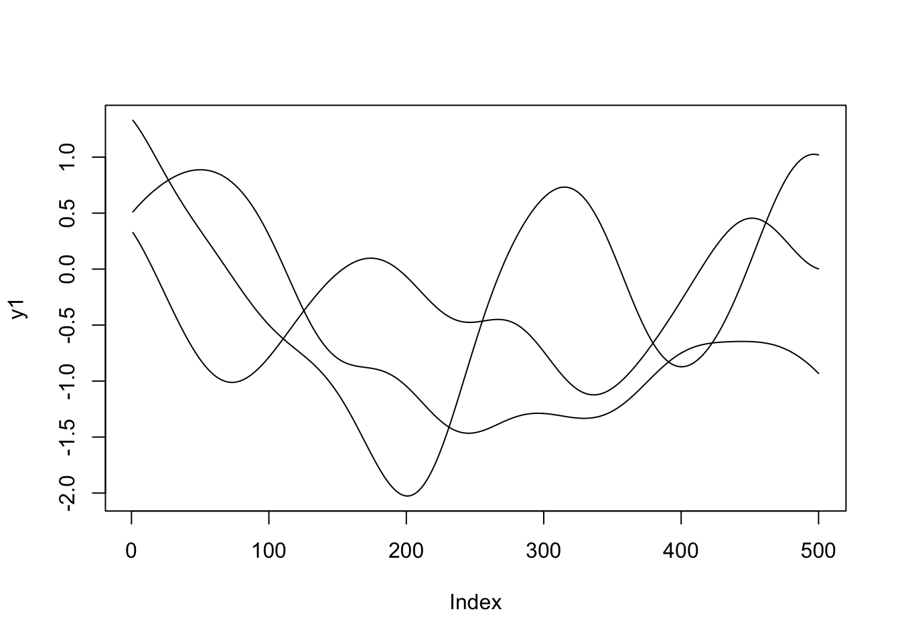

# Logistic regression {#logistic-regression}

Supervised learning refers to the task of inferring functions from a labelled set of data. Typically, the labelled dataset contains a matched pair of observations, with $\mathbf{y} = (y_1,\ldots,y_n)^\top$ denoting a vector containing observations of the variable of interest (output variable), and $\mathbf{X}$ denoting a matrix containing the observed values for the explanatory variables (input variables). Depending on the natre of the data, supervised learning involves either regression or classification. 

Within a regression setting, we aim to identify how a continuous-valued output variable is predicted from the input variables. That is, we aim to learning a function that maps from the input to output variable, which should reveal something about the nature of the system itself. By learning an appropriate function, we can also predict the values of the output variable at new set of test locations i.e., positions where no observations have been made.

Classification algorithms, on the other hand, deal with discrete-valued outputs, such as where $y$ can be only  a $0$ or $1$, or else where it falls into a number of classes e.g., "group 1", "group 2" or "group 3". The aim here is to learn how the potentially continuous input values map to the discrete class label, and ultimately, assign class labels for a new set of data.

Within this chapter we will briefly recap linear regression strategies, and introduce nonlinear approaches to regression based on Gaussian processes \@ref(regression). In section \@ref(classification) we introduce a variety of classification algorithms, starting with simple logistic regression and Gaussian process classification, before highlighting a variety of other techniques. 

## Regression {#regression}

Within this section, we will make use of the dataset from [@windram2012arabidopsis, GSE39597], which captures the gene expression levels in the model plant *Arabidopsis thaliana* following infection with the necrotrophic pathogen *Botrytis cinerea*, considered to be the second most important fungal plant pathogen dues to its ability to cause disease in a range of plants. The dataset represents a time series measuring the gene expression in *Arabidopsis* leaves following inoculation with *Botrytis cinerea*. Our variable of interest will therefore typically be the expression level of a particular gene, with the explanatory variable usually being time, or the expression level of a putative regulator.  

A pre-processed version of the data is available in the file is available here: \texttt{data/Arabidopsis/Arabidopsis_Botrytis_transpose_3.csv}. The processed data is a tab delimited file with the fist row containing gene IDs for 163 marker genes. Column 2 contains the time points of observations, with column 3 indicating which time series the datapoint belongs to (control versus infected time series). All subsequent columns indicate (log_2) normalised gene expression values from microarrays (V4 TAIR V9 spotted cDNA array). The expression dataset itself can therefore be split into two: the first $24$ observations represent measurements of *Arabidopsis* gene expression in a control experiment (uninfected), from $2h$ through $48h$ at $2$ hourly intervals; the second set of $24$ observations represents an infection datasets, from $2h$ after inoculation with *Botyris cinerea* through $48h$ at $2$ hourly intervals. 
We can read the dataset in as follows:


```r
geneindex <- 36
D <- read.csv(file = "data/Arabidopsis/Arabidopsis_Botrytis_transpose_3.csv", header = TRUE, sep = ",", row.names=1)
genenames <- colnames(D)
Xs <- D$Time[1:24]
```

Exercise 3.1. Plot the gene expression profiles to familiarise yourself with the data. Hint, you may need to add some noise in to the GP.

### Linear regression {#linear-regression}

One of the simplest regression models is linear regression, which assumes that the variable of interest, $y$, depends on an explanatory variable, $x$, via:

$y = mx + c.$

For a typical set of data, we have a vector of observations, $\mathbf{y} = \{y_1,y_2,\ldots,y_n\}$ with a corresponding set of explanatory variables. For now we can assume that the explanatory variable is scalar, for example time in hours, such that we have a set of observations, $\mathbf{x} = \{t_1,t_2,\ldots,t_n\}$. Using linear regression we aim to infer the parameters $m$ and $c$, which will tell us something about the relationship between the two variables, and allow us to make predictions at a new set of locations, $\mathbf{x}*$. 

Recall that within R, linear regression can be implemented via the \texttt{lm} function. In the example below, we perform linear regression for the gene expression of AT2G28890 as a function of time, using the infection time series only:


```r
lm(AT2G28890~Time, data = D[25:nrow(D),])
```

```
## 
## Call:
## lm(formula = AT2G28890 ~ Time, data = D[25:nrow(D), ])
## 
## Coefficients:
## (Intercept)         Time  
##    10.14010     -0.04997
```

Linear regression is also implemented within the \texttt{caret} package, allowing us to make use of its other utilities. In fact, within \texttt{caret}, linear regression is performed by calling the function \texttt{lm}:


```r
library(caret)
```

```
## Loading required package: lattice
```

```
## Loading required package: ggplot2
```

```r
library(mlbench)
set.seed(1)

lrfit <- train(y~., data=data.frame(x=Xs,y=D[25:nrow(D),geneindex]), method = "lm")
predictedValues<-predict(lrfit)
summary(lrfit)
```

```
## 
## Call:
## lm(formula = .outcome ~ ., data = dat)
## 
## Residuals:
##      Min       1Q   Median       3Q      Max 
## -0.77349 -0.17045 -0.01839  0.15795  0.63098 
## 
## Coefficients:
##             Estimate Std. Error t value Pr(>|t|)    
## (Intercept) 10.14010    0.13975   72.56  < 2e-16 ***
## x           -0.04997    0.00489  -10.22 8.14e-10 ***
## ---
## Signif. codes:  0 '***' 0.001 '**' 0.01 '*' 0.05 '.' 0.1 ' ' 1
## 
## Residual standard error: 0.3317 on 22 degrees of freedom
## Multiple R-squared:  0.826,	Adjusted R-squared:  0.8181 
## F-statistic: 104.4 on 1 and 22 DF,  p-value: 8.136e-10
```

Finally, we can also fit to the control dataset and plot the inferred results alongside the observation data:


```r
lrfit2 <- train(y~., data=data.frame(x=Xs,y=D[1:24,geneindex]), method = "lm")
predictedValues2<-predict(lrfit2)

plot(Xs,D[25:nrow(D),geneindex],type="p",col="black",ylim=c(min(D[,geneindex])-0.2, max(D[,geneindex]+0.2)),main=genenames[geneindex])
points(Xs,D[1:24,geneindex],type="p",col="red")
points(Xs,predictedValues,type="l",col="black")
points(Xs,predictedValues2,type="l",col="red")
```


Excercise 3.2. In our example, above, we fitted a linear model to a gene to identify parameters and make predictions using all the data and default settings. We can make use of the \texttt{caret} functionality to split our data into training and test sets, which should allow us to guage uncertainty in our parameters and the strength of the model.

Simple extensions to our linear model allow for more than one explanatory variable. For example, we could have two explanatory variables:

$y = m_1 x_1 + m_2 x_2 + c,$

which requires inference of $[m_1,m_2,c]$, or $n$ explanatory variables:

$y = \sum_{i=1}^n m_i x_i + c.$

requiring inference of $n+1$ parameters, $[m_1,\ldots,m_n,c]$. Such models can be useful when looking to identify statistical relationships that may exist within large datasets. For example, we could linearly regress the expression of AT2G28890 against the expression of a number of putative regulators. The values of the inferred parameters, $m_i$, should tell us how strongly the expression of gene $i$ influences AT2G28890.

Exercise 3.3. Regress the expression pattern of a gene against putative regulators to identify potential regulatory relationships.

#### Polynomial regression

In general, linear models will not be appropriate for a large variety of datasets, particularly when the variable of interest is nonlinear. We can instead try to fit more complex models to the dataset, such as a quadratic function of the form:

$y = m_1 x + m_2 x^2 + c,$

where $m = [m_1,m_2,c]$ represent the parameters we're interested in inferring. Higher order polynomials can be fitted:

$y = \sum_{i=1}^{n} m_i x^i + c.$

where $m = [m_1,\ldots,m_n,c]$ are the free parameters. Within R we can infer more complex polynomials to the data using the \texttt{lm} package. In the example below we fit a 3rd order polynomial:
 

```r
lrfit3 <- lm(y~poly(x,degree=3), data=data.frame(x=D[1:24,1],y=D[1:24,geneindex]))
```
 
We can do this within \texttt{caret} using the following snippet of code:
 

```r
lrfit3 <- train(y~poly(x,degree=3), data=data.frame(x=D[1:24,1],y=D[1:24,geneindex]), method = "lm")
lrfit4 <- train(y~poly(x,degree=3), data=data.frame(x=D[25:nrow(D),1],y=D[25:nrow(D),geneindex]), method = "lm")

plot(Xs,D[25:nrow(D),geneindex],type="p",col="black",ylim=c(min(D[,geneindex])-0.2, max(D[,geneindex]+0.2)),main=genenames[geneindex])
points(Xs,D[1:24,geneindex],type="p",col="red")
lines(Xs,fitted(lrfit3),type="l",col="red")
lines(Xs,fitted(lrfit4),type="l",col="black")
```


 
Note that the fit appears to be better than for the linear regression model. We can quantify this by looking at the RMSE.

Exercise 3.4. What happens if we fit a much higher order polynomial? Try fitting a polynomial with degree = 20 and plotting the result. The fit appears match much more closely to the observed data. However, intuitively we feel this is wrong. Whilst it may be possible that the data was generated by a polynomial, it's far more likely that we are overfitting the data. We can evaluate how good the model *really* is by looking at the RMSE from bootstrapped sampling. How does the RMSE compare? Which model seems to be best?

### Gaussian process regression {#gaussian-process-regression}

Gaussian processes regression [GPR, @Williams2006] represents a Bayesian nonparametric approach to regression capable of inferring potentially nonlinear functions a set of observations. Due to the Bayesian nature of these approaches, they tend to be much less prone to overfitting. Within GPR we assume the following:

$y = f(x)$

where $f(\cdot)$ is some unknown nonlinear function. Gaussian processes are completely defined by their mean function, $m(x)$, and covariance function, $(x,x^\prime)$, and we use the notation $f(x) \sim \mathcal{GP}(m(x), k(x,x^\prime))$ to denote a Gaussian process prior. For inference, we are typically have a set of observations, $\mathbf{X}$ and outputs $\mathbf{y}$, and are interested in inferring the values, $\mathbf{y}^*$, at new locations, $\mathbf{x}^*$. We can infer a posterior distribution for $f^*$ using Bayes' rule. A key advantage of GPs is the preditive distribution is analytically tractible and has the following form:

$y* | \mathbf{x}, \mathbf{y}, \mathbf{x}* \sim \mathcal{N}(f^*,K^*)$

where,

$f^* = k_*^\top(K)^{-1} y$,
$K^* = k(x_*,x_*)^{-1} - k_*^\top (K)^{-1} k_*$.

In many cases, we assume our observations are corrupted by independent noise:

$y = f(x) + \varepsilon$

where $\varepsilon$ represents observational noise. In this case, we have:

$f^* = k_*^\top(K+\sigma_n^2 \mathbb{I})^{-1} y$,
$K^* = k(x_*,x_*)^{-1} - k_*^\top (K+\sigma_n^2 \mathbb{I})^{-1} k_*$.

Although the most comprehensive GP toolboxes can be found in MATLAB or Python, such as the [GPML](http://www.gaussianprocess.org/gpml/code/matlab/doc/) and [GPy](https://github.com/SheffieldML/GPy), toolboxes. some GP resources exist in R, including this [blog](https://www.r-bloggers.com/gaussian-process-regression-with-r/), which has begun to implemented a variety of applications used within the Matlab \texttt{gpml} package. 

In the example, below, we implement some basic GPs to better understand what it is they're doing. We first require a number of packages.


```r
require(MASS)
```

```
## Loading required package: MASS
```

```r
require(plyr)
```

```
## Loading required package: plyr
```

```r
require(reshape2)
```

```
## Loading required package: reshape2
```

```r
require(ggplot2)
```

Recall that the GP is completely defined by its mean function and covariance function. We can assume a zero-mean function without loss of generality, but we must define a covariance function ahead of inference. The most commonly used covariance function is the squared exponential covariance function, defined as:

$C(x,x^\prime) = \sigma^2 \exp\biggl{(}\frac{(x-x^\prime)^2}{2l^2}\biggr{)}$,

The SE covariance function encodes for smooth functions, and has two hyperparameters: a length-scale hyperparameter $l$, which defines roughly how fast the functions change over the input space, and a process variance hyperparameter, $\sigma$, which encodes the amplitude of the function. In the snippet of code, below, we implement a squared exponential covariance function


```r
covSE <- function(X1,X2,l=1,sig=1) {
  K <- matrix(rep(0, length(X1)*length(X2)), nrow=length(X1))
  for (i in 1:nrow(K)) {
    for (j in 1:ncol(K)) {
      K[i,j] <- sig^2*exp(-0.5*(abs(X1[i]-X2[j]))^2 /l^2)
    }
  }
  return(K)
}
```

To get an idea of what this means, we can generate samples from the GP prior at a set of defined positions along $x$.


```r
x.star <- seq(-5,5,len=500) ####Define a set of points at which to evaluate the functions
sigma  <- covSE(x.star,x.star) ###Evaluate the covariance function at those locations, to give the covariance matrix.
y1 <- mvrnorm(1, rep(0, length(x.star)), sigma)
y2 <- mvrnorm(1, rep(0, length(x.star)), sigma)
y3 <- mvrnorm(1, rep(0, length(x.star)), sigma)
plot(y1,type = 'l',ylim=c(min(y1,y2,y3),max(y1,y2,y3)))
lines(y2)
lines(y3)
```



When we specify a GP, we are essentially encoding a distribution over a whole range of functions. Exactly how those functions behave depends upon the choice of covariance function and the hyperparameters. To get a feel for this, try changing the hyperparameters in the above code. A variety of other covariance functions exist, and can be found, with examples in the [Kernel Cookbook](http://www.cs.toronto.edu/~duvenaud/cookbook/).

Exercise 3.4 (optional): Try implementing another covariance function from the [Kernel Cookbook](http://www.cs.toronto.edu/~duvenaud/cookbook/) and generating samples from the GP prior.

### Inference using Gaussian process regression

We can generate samples from the GP prior, but what about inference? In linear regression we aimed to infer the parameters, $m$ and $a$. What is the GP doing? Essentially, it's representing the (unknown) function in terms of the observed data (and the hyperparameters). Another way to look at it, is that we've specified our prior distribution (encoding for all functions of a particular kind), and during the inference procedure we're giving a greater weight to a subset of those functions that pass close to our observed datapoints. 

To demonstrate this, let's assume we have an unknown function. In our example, for data generation, we will assume this to be $y = sin(x)$ as an illustrative example of a nonlinear function. We might have some observations from this function at a set of input positions $x$ e.g., we have one observation at $x=-2$:


```r
f <- data.frame(x=c(-2),
                y=sin(c(-2)))
```

We can infer a posterior GP (and plot this against the true underlying function in red):


```r
x <- f$x
k.xx <- covSE(x,x)
k.xxs <- covSE(x,x.star)
k.xsx <- covSE(x.star,x)
k.xsxs <- covSE(x.star,x.star)

f.star.bar <- k.xsx%*%solve(k.xx)%*%f$y  ###Mean
cov.f.star <- k.xsxs - k.xsx%*%solve(k.xx)%*%k.xxs ###Var

plot(x.star,sin(x.star),type = 'l',col="red",ylim=c(-2.2, 2.2))
points(f,type='o')
lines(x.star,f.star.bar,type = 'l')
lines(x.star,f.star.bar+2*sqrt(diag(cov.f.star)),type = 'l',pch=22, lty=2, col="black")
lines(x.star,f.star.bar-2*sqrt(diag(cov.f.star)),type = 'l',pch=22, lty=2, col="black")
```


Of course the fit is not particularly good, but we only had one observation, so this is not surprising. Crucially, we can see that the GP encodes the idea of uncertainty. Although the model fit is not particularly good, we can see exactly *where* it is no good.

Exercise 3.5 (optional): Try plotting some sample function from the posterior GP. Hint: these will be Gaussian distributed with mean \texttt{f.star.bar} and covariance \texttt{cov.f.star}.

Let's start by adding more observations. Here's what the posterior fit looks like if we include 4 observations (at $x \in [-4,-2,0,1]$):


```r
f <- data.frame(x=c(-4,-2,0,1),
                y=sin(c(-4,-2,0,1)))
x <- f$x
k.xx <- covSE(x,x)
k.xxs <- covSE(x,x.star)
k.xsx <- covSE(x.star,x)
k.xsxs <- covSE(x.star,x.star)

f.star.bar <- k.xsx%*%solve(k.xx)%*%f$y  ###Mean
cov.f.star <- k.xsxs - k.xsx%*%solve(k.xx)%*%k.xxs ###Var

plot(x.star,sin(x.star),type = 'l',col="red",ylim=c(-2.2, 2.2))
points(f,type='o')
lines(x.star,f.star.bar,type = 'l')
lines(x.star,f.star.bar+2*sqrt(diag(cov.f.star)),type = 'l',pch=22, lty=2, col="black")
lines(x.star,f.star.bar-2*sqrt(diag(cov.f.star)),type = 'l',pch=22, lty=2, col="black")
```


Definitely getting better, and we still have a good grasp of where the model is uncertain. With $7$ observations:


```r
f <- data.frame(x=c(-4,-3,-2,-1,0,1,2),
                y=sin(c(-4,-3,-2,-1,0,1,2)))
x <- f$x
k.xx <- covSE(x,x)
k.xxs <- covSE(x,x.star)
k.xsx <- covSE(x.star,x)
k.xsxs <- covSE(x.star,x.star)

f.star.bar <- k.xsx%*%solve(k.xx)%*%f$y  ###Mean
cov.f.star <- k.xsxs - k.xsx%*%solve(k.xx)%*%k.xxs ###Var

plot(x.star,sin(x.star),type = 'l',col="red",ylim=c(-2.2, 2.2))
points(f,type='o')
lines(x.star,f.star.bar,type = 'l')
lines(x.star,f.star.bar+2*sqrt(diag(cov.f.star)),type = 'l',pch=22, lty=2, col="black")
lines(x.star,f.star.bar-2*sqrt(diag(cov.f.star)),type = 'l',pch=22, lty=2, col="black")
```


We can see that even with only $7$ observations the posterior GP has begun to resemble the true (nonlinear) function very well: over most of the $x$-axis the mean of the GP lies very close to the true function and, perhaps more importantly, we continue to have an treatment for the uncertainty.

#### Marginal Likelihood and Hyperparameters

Another key aspect of GP regression is the ability to analytically evaluate the marginal likelihood, otherwise referred to as the "model evidence". For a GP this is:

$\ln p(\mathbf{y}|\mathbf{x}) = -\frac{1}{2}\mathbf{y}^\top (K)^{-1} \mathbf{y} -\frac{1}{2} \ln |K| - \frac{n}{2}\ln 2\pi$

We calculate this in the snippet of code, below:


```r
calcML <- function(f,l=1,sig=1) {
  f2 <- t(f)
  yt <- f2[2,]
  y  <- f[,2]
  K <- covSE(f[,1],f[,1],l,sig)
  ML <- -0.5*yt%*%ginv(K+0.1^2*diag(length(y)))%*%y -0.5*log(det(K)) -(length(f[,1])/2)*log(2*pi);
  return(ML)
}
```

The ability to calculate the marginal likelihood gives us a way to automatically select the hyperparameters. We can increment hyperparameters over a range of values, and choose the values that yield the greatest marginal likelihood. In the example, below, we increment both the length-scale and process variance hyperparameter:


```r
###install.packages("plot3D")
library(plot3D)

par <- seq(.1,10,by=0.1)
ML <- matrix(rep(0, length(par)^2), nrow=length(par), ncol=length(par))
for(i in 1:length(par)) {
  for(j in 1:length(par)) {
    ML[i,j] <- calcML(f,par[i],par[j])
  }
}
persp3D(z = ML,theta = 120)
```


```r
ind<-which(ML==max(ML), arr.ind=TRUE)
print(c("length-scale", par[ind[1]]))
```

```
## [1] "length-scale" "2.4"
```

```r
print(c("process variance", par[ind[2]]))
```

```
## [1] "process variance" "1.3"
```

Here we have performed a grid search to identify the optimal hyperparameters. In actuality, the derivative of the marginal likelihood with respect to the hyperparameters is analytically tractable, allowing us to optimise using gradient search algorithms. 

Exercise 3.6: Try fitting plotting the GP using the optimised hyperparameter values. 

Exercise 3.7: Now try fitting a Gaussian process to one of the gene expression profiles in the Botrytis dataset. Hint: You may need to normalise the time axis. Since this data also contains a high level of noise you will also need to use covariance function/ML calculation that incorporates this (the code below does this, with the noise representing a $3$rd hyperparameter).


```r
covSEn <- function(X1,X2,l=1,sig=1,sigman=0.1) {
  K <- matrix(rep(0, length(X1)*length(X2)), nrow=length(X1))
  for (i in 1:nrow(K)) {
    for (j in 1:ncol(K)) {
      
      K[i,j] <- sig^2*exp(-0.5*(abs(X1[i]-X2[j]))^2 /l^2)
      
      if (i==j){
      K[i,j] <- K[i,j] + sigman^2
      }
      
    }
  }
  return(K)
}
```


```r
calcMLn <- function(f,l=1,sig=1,sigman=0.1) {
  f2 <- t(f)
  yt <- f2[2,]
  y  <- f[,2]
  K <- covSE(f[,1],f[,1],l,sig)
  ML <- -0.5*yt%*%ginv(K+diag(length(y))*sigman^2)%*%y -0.5*log(det(K+diag(length(y))*sigman^2)) -(length(f[,1])/2)*log(2*pi);
  return(ML)
}
```

### Model Selection

As well as being a useful criterion for selecting hyperparameters, the marginal likelihood can be used as a basis for selecting models. For example, we might be interested in comparing how well we fit the data using two different covariance functions: for example a squared exponential covariance function (model 1, $M_1$) versus a periodic covariance function (model 2, $M_2$). By taking the ratio of the marginal likelihoods we calculate the [Bayes' Factor](https://en.wikipedia.org/wiki/Bayes_factor) (BF) which allows us to determine which model is the best:

$\mbox{BF} = \frac{ML(M_1)}{ML(M_2)}$.

Very high values for the BF indicate strong evidence for $M_1$ over $M_2$, whilst low values would indicate the contrary.

#### Advanced application 1: differential expression of time series

Differential expression analysis is concerned with identifying if two sets of data are significantly different. For example, if one measured the expression level of a gene in two different conditions, you could use an appropriate statistical test to determine whether the expression of those genes had changed significantly in the two conditions. These test commonly include t-tests, which are not appropriate when dealing with time series data (illustrated in Figure \@ref(fig:dimreduc)). 

<div class="figure" style="text-align: center">

<p class="caption">(\#fig:timeser)Differential expression analysis for time series. Here we have two time series with very different behaviour (right). However, as a whole the mean and variance of the time series is identical (left) and the datasets are not differentially expressed using a t-test (p<0.9901)</p>
</div>

Gaussian processes regression represents a useful way of modelling time series, and can therefore be used as a basis for detecting differential expression. To do so we can write down two competing modes: (i) the two time series are differentially expressed, and are therefore best described by two independent GPs; (ii) the two time series are noisy observations from an identical underlying process, and are therefore best described by a single joint GP. 

Exercise 3.8 (optional): Write a function for determining differential expression for two genes. Hint: you will need to fit $3$ GPs: one to the mock, one to the control, and one to the union of mock and control. You can use the ML to determine if the gene is differentially expressed.

#### Advanced Application 2: Timing of differential expression 

Nonlinear Bayesian regression represent a powerful tool for modelling. In the previous section we have shown how GPs can be used to model if two time series are differentially expressed. More advanced models using GPs aim to identify **when** two (or more) time series diverge [@Stegle2010robust,@yang2016inferring,@penfold2017nonparametric]. The [DEtime](https://github.com/ManchesterBioinference/DEtime) algorithm [@yang2016inferring] is an R-based codebase for doing so.


```r
###install.packages("devtools")
library(devtools)
###install_github("ManchesterBioinference/DEtime")
###import(DEtime)
library(DEtime)
```

Within \texttt{DEtime}, we can call the function \texttt{DEtime_rank} to calculate marginal likelihoods for two time series, similar to our application in the previous section. Note that here, unlike our analysis, the hyperparameters are optimised by gradient search rather than grid searches. 


```r
res_rank <- DEtime_rank(ControlTimes = Xs, ControlData = D[1:24,3], PerturbedTimes = Xs, PerturbedData = D[25:48,3], savefile=TRUE)
```

```
## [1] "gene IDs are not provided. Numbers are used instead"
## rank list saved in DEtime_rank.txt
```

```r
#idx <- which(res_rank[,2]>1)
```

For genes that are DE, we identify the timing of divergence between two time series using the function \texttt{DEtime_infer}.


```r
res <- DEtime_infer(ControlTimes = Xs, ControlData = D[1:24,3], PerturbedTimes = Xs, PerturbedData = D[25:48,3])
```

```
## gene IDs are not provided. Numbers are used instead.
## Testing perturbation time points are not provided. Default one is used.
## gene 1 is done
## DEtime inference is done.
## Please use print_DEtime or plot_DEtime to view the results.
```

```r
print_DEtime
```

```
## function (DEtimeOutput) 
## {
##     cat("Perturbation point inference results from DEtime package: \n")
##     cat("==========================================================\n")
##     print(DEtimeOutput$result, sep = "\t", zero.print = ".")
##     cat("==========================================================\n")
## }
## <environment: namespace:DEtime>
```

```r
plot_DEtime(res)
```

```
## All genes will be plotted 
## 1 is plotted
```

We can do it for all genes using the example below. By doing so, we can plot a histogram of the times of divergence, shedding light on the temporal progression of the infection process.


```r
res <- DEtime_infer(ControlTimes = Xs, ControlData = t(D[1:24,]), PerturbedTimes = Xs, PerturbedData = t(D[25:48,]))
```

```
## ControlData is accepted
## PerturbedData is accepted
## gene IDs are not provided. Numbers are used instead.
## Testing perturbation time points are not provided. Default one is used.
## gene 1 is done
## gene 2 is done
## gene 3 is done
## gene 4 is done
## gene 5 is done
## gene 6 is done
## gene 7 is done
## gene 8 is done
## gene 9 is done
## gene 10 is done
## gene 11 is done
## gene 12 is done
## gene 13 is done
## gene 14 is done
## gene 15 is done
## gene 16 is done
## gene 17 is done
## gene 18 is done
## gene 19 is done
## gene 20 is done
## gene 21 is done
## gene 22 is done
## gene 23 is done
## gene 24 is done
## gene 25 is done
## gene 26 is done
## gene 27 is done
## gene 28 is done
## gene 29 is done
## gene 30 is done
## gene 31 is done
## gene 32 is done
## gene 33 is done
## gene 34 is done
## gene 35 is done
## gene 36 is done
## gene 37 is done
## gene 38 is done
## gene 39 is done
## gene 40 is done
## gene 41 is done
## gene 42 is done
## gene 43 is done
## gene 44 is done
## gene 45 is done
## gene 46 is done
## gene 47 is done
## gene 48 is done
## gene 49 is done
## gene 50 is done
## gene 51 is done
## gene 52 is done
## gene 53 is done
## gene 54 is done
## gene 55 is done
## gene 56 is done
## gene 57 is done
## gene 58 is done
## gene 59 is done
## gene 60 is done
## gene 61 is done
## gene 62 is done
## gene 63 is done
## gene 64 is done
## gene 65 is done
## gene 66 is done
## gene 67 is done
## gene 68 is done
## gene 69 is done
## gene 70 is done
## gene 71 is done
## gene 72 is done
## gene 73 is done
## gene 74 is done
## gene 75 is done
## gene 76 is done
## gene 77 is done
## gene 78 is done
## gene 79 is done
## gene 80 is done
## gene 81 is done
## gene 82 is done
## gene 83 is done
## gene 84 is done
## gene 85 is done
## gene 86 is done
## gene 87 is done
## gene 88 is done
## gene 89 is done
## gene 90 is done
## gene 91 is done
## gene 92 is done
## gene 93 is done
## gene 94 is done
## gene 95 is done
## gene 96 is done
## gene 97 is done
## gene 98 is done
## gene 99 is done
## gene 100 is done
## gene 101 is done
## gene 102 is done
## gene 103 is done
## gene 104 is done
## gene 105 is done
## gene 106 is done
## gene 107 is done
## gene 108 is done
## gene 109 is done
## gene 110 is done
## gene 111 is done
## gene 112 is done
## gene 113 is done
## gene 114 is done
## gene 115 is done
## gene 116 is done
## gene 117 is done
## gene 118 is done
## gene 119 is done
## gene 120 is done
## gene 121 is done
## gene 122 is done
## gene 123 is done
## gene 124 is done
## gene 125 is done
## gene 126 is done
## gene 127 is done
## gene 128 is done
## gene 129 is done
## gene 130 is done
## gene 131 is done
## gene 132 is done
## gene 133 is done
## gene 134 is done
## gene 135 is done
## gene 136 is done
## gene 137 is done
## gene 138 is done
## gene 139 is done
## gene 140 is done
## gene 141 is done
## gene 142 is done
## gene 143 is done
## gene 144 is done
## gene 145 is done
## gene 146 is done
## gene 147 is done
## gene 148 is done
## gene 149 is done
## gene 150 is done
## gene 151 is done
## gene 152 is done
## gene 153 is done
## gene 154 is done
## gene 155 is done
## gene 156 is done
## gene 157 is done
## gene 158 is done
## gene 159 is done
## gene 160 is done
## gene 161 is done
## gene 162 is done
## gene 163 is done
## gene 164 is done
## DEtime inference is done.
## Please use print_DEtime or plot_DEtime to view the results.
```

```r
hist(as.numeric(res$result[,2]))
```


```r
hist(as.numeric(res$result[,2]),breaks=20)
```


#### Scalability

Whilst GPs represent a powerful approach to nonlinear regression, they do have some limitations. Computationally, GPs do not scale well with the number of observations, and standard GP approaches are not suitable when we have a large number of observations. In your own time, you can try generating increasingly long time series, and attempting to fit a GP to the data. To overcome these limitations, approximate approaches to inference with GPs have been developed. 

## Classification

Classification algorithms are a supervised learning techniques that assign data to categorical outputs. For example we may have a continuous input variable, $x$, and want to learn how that variable maps to a discrete valued output, $y\in [0,1]$, which might represent a phenotype (infected versus uninfected). 

### Logistic regression

Linear regression models attempted to fit to real valued data, and are therefore not appropriate for classification. The simplest form of classification is logistic regression, which attempt to fit to the log odds:

$\ln \biggl{(}\frac{\mathbb{P}(y=1|x)}{1-\mathbb{P}(y=1|x)}\biggr{)} = c + m_1 x_1 + \ldots m_n x_n$

Unlike linear regression, these models do not admit closed form solutions, but are typically solved iteratively. Within \texttt{caret}, logistic regression can applied using the \texttt{glm} function. To illustate this we will again make use of our plant dataset. Within this dataset, the second column represents a binary variable indicating the infection status of the plant e.g., whether the plant has been infected with *Botrytis cinerea* or not. We will aim to learn a set of markers capable of predicting infection status. We first run a logistic regression:


```r
library(pROC)
```

```
## Type 'citation("pROC")' for a citation.
```

```
## 
## Attaching package: 'pROC'
```

```
## The following objects are masked from 'package:stats':
## 
##     cov, smooth, var
```

```r
library(ROCR)
```

```
## Loading required package: gplots
```

```
## 
## Attaching package: 'gplots'
```

```
## The following object is masked from 'package:stats':
## 
##     lowess
```

```r
options(warn=-1)
mod_fit <- train(y ~ ., data=data.frame(x = D[,3:ncol(D)], y = as.factor(D$Class)), method="glm", family="binomial")
```

We will now load in a second dataset, containnig a new set of observatoins not seen by the model, and attempt to predict the infection status. 


```r
Dpred <- read.csv(file = "data/Arabidopsis/Arabidopsis_Botrytis_pred_transpose_3.csv", header = TRUE, sep = ",", row.names=1)

prob <- predict(mod_fit, newdata=data.frame(x = Dpred[,3:ncol(Dpred)], y = as.factor(Dpred$Class)), type="prob")
pred <- prediction(prob$`1`, as.factor(Dpred$Class))
```

To evaluate how well the algorithm has done, we can calculate a variety of summary statistics. For example the number of true positives, true negatives, false positive and false negatives. A useful summary is to plot the ROC curve (false positive rate versus true positive rate) and calculate the area under that curve. For a perfect algorithm, the area under this curve (AUC) will be equal to $1$, whereas random assignment would give an area of $0.5$. In the example below, we will calculate the AUC for a logistic regression model:


```r
perf <- performance(pred, measure = "tpr", x.measure = "fpr")
plot(perf)
```


```r
auc <- performance(pred, measure = "auc")
auc <- auc@y.values[[1]]
auc
```

```
## [1] 0.5677083
```

## GP classification

Classification approaches using Gaussian processes are also possible. Unlike Gaussian process regression, Gaussian process classification is not analytically tractable, and we must instead use approximations. 
A GP classified has been implemented in \texttt{caret} using a polynomial kernel, and can be called using the following code:


```r
mod_fit2 <- train(y ~ ., data=data.frame(x = D[,3:ncol(D)], y = as.factor(D$Class)), method="gaussprPoly")
```

```
## 
## Attaching package: 'kernlab'
```

```
## The following object is masked from 'package:ggplot2':
## 
##     alpha
```

We can again evaluate how well the algorithm has done:


```r
prob <- predict(mod_fit2, newdata=data.frame(x = Dpred[,3:ncol(Dpred)], y = as.factor(Dpred$Class)), type="prob")
pred <- prediction(prob$`1`, as.factor(Dpred$Class))
perf <- performance(pred, measure = "tpr", x.measure = "fpr")
plot(perf)
```


```r
auc <- performance(pred, measure = "auc")
auc <- auc@y.values[[1]]
auc
```

```
## [1] 0.9577908
```


### Other classification approaches.

In some instances, ensemble learning, which combines predictions from multiple algorithms, can increase the predictive accuracy in classification tasks. A large variety of classification algorithms are availble in \texttt{caret}, including random forests, support vector machines, Bayesian generalised linear models. Some of these approaches have been implemented below.


```r
library("stepPlr")
library("caTools")
library("arm")
```

```
## Loading required package: Matrix
```

```
## Loading required package: lme4
```

```
## 
## arm (Version 1.9-3, built: 2016-11-21)
```

```
## Working directory is /Users/matt/git_repositories/intro-machine-learning
```

```r
library("party")
```

```
## Loading required package: grid
```

```
## Loading required package: mvtnorm
```

```
## Loading required package: modeltools
```

```
## Loading required package: stats4
```

```
## 
## Attaching package: 'modeltools'
```

```
## The following object is masked from 'package:lme4':
## 
##     refit
```

```
## The following object is masked from 'package:kernlab':
## 
##     prior
```

```
## The following object is masked from 'package:plyr':
## 
##     empty
```

```
## Loading required package: strucchange
```

```
## Loading required package: zoo
```

```
## 
## Attaching package: 'zoo'
```

```
## The following objects are masked from 'package:base':
## 
##     as.Date, as.Date.numeric
```

```
## Loading required package: sandwich
```

```r
library("kernlab")
library("nnet")
mod_fit1 <- train(y ~ x, data=data.frame(x = D$AT1G03960, y = as.factor(D$Class)), method="plr")

mod_fit2 <- train(y ~ x, data=data.frame(x = D$AT1G03960, y = as.factor(D$Class)), method="LogitBoost", family="binomial")

mod_fit3 <- train(y ~ x, data=data.frame(x = D$AT1G03960, y = as.factor(D$Class)), method="bayesglm", family="binomial")

mod_fit4 <- train(y ~ x, data=data.frame(x = D$AT1G03960, y = as.factor(D$Class)), method="cforest")

mod_fit5 <- train(y ~ x, data=data.frame(x = D$AT1G03960, y = as.factor(D$Class)), method="svmRadialWeights")

mod_fit6 <- train(y ~ x, data=data.frame(x = D$AT1G03960, y = as.factor(D$Class)), method="multinom")
```

```
## # weights:  3 (2 variable)
## initial  value 33.271065 
## iter  10 value 30.519099
## final  value 30.519095 
## converged
## # weights:  3 (2 variable)
## initial  value 33.271065 
## final  value 32.947216 
## converged
## # weights:  3 (2 variable)
## initial  value 33.271065 
## iter  10 value 30.549852
## final  value 30.549849 
## converged
## # weights:  3 (2 variable)
## initial  value 33.271065 
## iter  10 value 25.636358
## final  value 25.636172 
## converged
## # weights:  3 (2 variable)
## initial  value 33.271065 
## final  value 32.267782 
## converged
## # weights:  3 (2 variable)
## initial  value 33.271065 
## iter  10 value 25.713037
## final  value 25.712865 
## converged
## # weights:  3 (2 variable)
## initial  value 33.271065 
## iter  10 value 29.055866
## final  value 29.055660 
## converged
## # weights:  3 (2 variable)
## initial  value 33.271065 
## final  value 32.570213 
## converged
## # weights:  3 (2 variable)
## initial  value 33.271065 
## iter  10 value 29.098966
## final  value 29.098804 
## converged
## # weights:  3 (2 variable)
## initial  value 33.271065 
## final  value 32.167482 
## converged
## # weights:  3 (2 variable)
## initial  value 33.271065 
## final  value 32.999983 
## converged
## # weights:  3 (2 variable)
## initial  value 33.271065 
## final  value 32.178039 
## converged
## # weights:  3 (2 variable)
## initial  value 33.271065 
## final  value 32.948048 
## converged
## # weights:  3 (2 variable)
## initial  value 33.271065 
## final  value 33.252251 
## converged
## # weights:  3 (2 variable)
## initial  value 33.271065 
## final  value 32.953327 
## converged
## # weights:  3 (2 variable)
## initial  value 33.271065 
## final  value 30.493155 
## converged
## # weights:  3 (2 variable)
## initial  value 33.271065 
## final  value 32.661797 
## converged
## # weights:  3 (2 variable)
## initial  value 33.271065 
## final  value 30.527775 
## converged
## # weights:  3 (2 variable)
## initial  value 33.271065 
## iter  10 value 29.425208
## iter  20 value 29.425121
## final  value 29.425115 
## converged
## # weights:  3 (2 variable)
## initial  value 33.271065 
## final  value 32.110804 
## converged
## # weights:  3 (2 variable)
## initial  value 33.271065 
## iter  10 value 29.464259
## iter  20 value 29.464192
## final  value 29.464187 
## converged
## # weights:  3 (2 variable)
## initial  value 33.271065 
## iter  10 value 30.805327
## iter  10 value 30.805326
## iter  10 value 30.805326
## final  value 30.805326 
## converged
## # weights:  3 (2 variable)
## initial  value 33.271065 
## final  value 33.036134 
## converged
## # weights:  3 (2 variable)
## initial  value 33.271065 
## iter  10 value 30.836670
## iter  10 value 30.836670
## iter  10 value 30.836670
## final  value 30.836670 
## converged
## # weights:  3 (2 variable)
## initial  value 33.271065 
## final  value 31.270571 
## converged
## # weights:  3 (2 variable)
## initial  value 33.271065 
## final  value 32.687211 
## converged
## # weights:  3 (2 variable)
## initial  value 33.271065 
## final  value 31.287343 
## converged
## # weights:  3 (2 variable)
## initial  value 33.271065 
## iter  10 value 23.982050
## iter  20 value 23.973564
## iter  30 value 23.970664
## iter  40 value 23.969663
## iter  50 value 23.969316
## iter  60 value 23.969197
## iter  70 value 23.969156
## final  value 23.969148 
## converged
## # weights:  3 (2 variable)
## initial  value 33.271065 
## final  value 32.160340 
## converged
## # weights:  3 (2 variable)
## initial  value 33.271065 
## iter  10 value 24.161702
## iter  20 value 24.155332
## iter  30 value 24.153316
## iter  40 value 24.152661
## iter  50 value 24.152448
## iter  60 value 24.152378
## final  value 24.152357 
## converged
## # weights:  3 (2 variable)
## initial  value 33.271065 
## final  value 30.692224 
## converged
## # weights:  3 (2 variable)
## initial  value 33.271065 
## final  value 32.841096 
## converged
## # weights:  3 (2 variable)
## initial  value 33.271065 
## final  value 30.718870 
## converged
## # weights:  3 (2 variable)
## initial  value 33.271065 
## final  value 31.265330 
## converged
## # weights:  3 (2 variable)
## initial  value 33.271065 
## final  value 33.032727 
## converged
## # weights:  3 (2 variable)
## initial  value 33.271065 
## final  value 31.287627 
## converged
## # weights:  3 (2 variable)
## initial  value 33.271065 
## final  value 32.036951 
## converged
## # weights:  3 (2 variable)
## initial  value 33.271065 
## final  value 33.139283 
## converged
## # weights:  3 (2 variable)
## initial  value 33.271065 
## final  value 32.048115 
## converged
## # weights:  3 (2 variable)
## initial  value 33.271065 
## final  value 29.350332 
## converged
## # weights:  3 (2 variable)
## initial  value 33.271065 
## final  value 32.502353 
## converged
## # weights:  3 (2 variable)
## initial  value 33.271065 
## final  value 29.394715 
## converged
## # weights:  3 (2 variable)
## initial  value 33.271065 
## final  value 32.270383 
## converged
## # weights:  3 (2 variable)
## initial  value 33.271065 
## final  value 33.010581 
## converged
## # weights:  3 (2 variable)
## initial  value 33.271065 
## final  value 32.280061 
## converged
## # weights:  3 (2 variable)
## initial  value 33.271065 
## final  value 30.395874 
## converged
## # weights:  3 (2 variable)
## initial  value 33.271065 
## final  value 32.556082 
## converged
## # weights:  3 (2 variable)
## initial  value 33.271065 
## final  value 30.419405 
## converged
## # weights:  3 (2 variable)
## initial  value 33.271065 
## final  value 31.565403 
## converged
## # weights:  3 (2 variable)
## initial  value 33.271065 
## final  value 33.009702 
## converged
## # weights:  3 (2 variable)
## initial  value 33.271065 
## final  value 31.583442 
## converged
## # weights:  3 (2 variable)
## initial  value 33.271065 
## iter  10 value 23.540015
## iter  20 value 23.530522
## final  value 23.530454 
## converged
## # weights:  3 (2 variable)
## initial  value 33.271065 
## final  value 32.442863 
## converged
## # weights:  3 (2 variable)
## initial  value 33.271065 
## iter  10 value 23.706005
## iter  20 value 23.699247
## final  value 23.699226 
## converged
## # weights:  3 (2 variable)
## initial  value 33.271065 
## final  value 29.830235 
## converged
## # weights:  3 (2 variable)
## initial  value 33.271065 
## final  value 32.429878 
## converged
## # weights:  3 (2 variable)
## initial  value 33.271065 
## final  value 29.860272 
## converged
## # weights:  3 (2 variable)
## initial  value 33.271065 
## final  value 27.681555 
## converged
## # weights:  3 (2 variable)
## initial  value 33.271065 
## final  value 32.764666 
## converged
## # weights:  3 (2 variable)
## initial  value 33.271065 
## final  value 27.752198 
## converged
## # weights:  3 (2 variable)
## initial  value 33.271065 
## iter  10 value 29.950934
## final  value 29.950910 
## converged
## # weights:  3 (2 variable)
## initial  value 33.271065 
## final  value 32.928940 
## converged
## # weights:  3 (2 variable)
## initial  value 33.271065 
## iter  10 value 30.002486
## final  value 30.002468 
## converged
## # weights:  3 (2 variable)
## initial  value 33.271065 
## final  value 32.492517 
## converged
## # weights:  3 (2 variable)
## initial  value 33.271065 
## final  value 33.132159 
## converged
## # weights:  3 (2 variable)
## initial  value 33.271065 
## final  value 32.498412 
## converged
## # weights:  3 (2 variable)
## initial  value 33.271065 
## final  value 28.798141 
## converged
## # weights:  3 (2 variable)
## initial  value 33.271065 
## final  value 32.898210 
## converged
## # weights:  3 (2 variable)
## initial  value 33.271065 
## final  value 28.861514 
## converged
## # weights:  3 (2 variable)
## initial  value 33.271065 
## final  value 32.513424 
## converged
## # weights:  3 (2 variable)
## initial  value 33.271065 
## final  value 33.177424 
## converged
## # weights:  3 (2 variable)
## initial  value 33.271065 
## final  value 32.521012 
## converged
## # weights:  3 (2 variable)
## initial  value 33.271065 
## iter  10 value 27.532922
## iter  20 value 27.532659
## final  value 27.532640 
## converged
## # weights:  3 (2 variable)
## initial  value 33.271065 
## final  value 31.956413 
## converged
## # weights:  3 (2 variable)
## initial  value 33.271065 
## iter  10 value 27.590425
## iter  20 value 27.590214
## final  value 27.590199 
## converged
## # weights:  3 (2 variable)
## initial  value 33.271065 
## final  value 30.783532 
## converged
```

Excercise 3.7. Take a look at the predictive accuracy of some of the other algorithms. How would you begin to go about combining predictions from multiple algorithms? 

## Resources

A variety of examples using \texttt{caret} to perform regression and classification have been implemented 
[here](https://github.com/tobigithub/caret-machine-learning).

More comprehensive Gaussian process packages are available in Matlab including [GPML](http://www.gaussianprocess.org/gpml/code/matlab/doc/), and Python, [GPy](https://github.com/SheffieldML/GPy). GP code based on [Tensorflow](https://www.tensorflow.org) is also available in the form of [GPflow](http://gpflow.readthedocs.io/en/latest/intro.html) and   [GPflowopt](https://github.com/GPflow/GPflowOpt).

=======
## Exercises

Solutions to exercises can be found in appendix \@ref(solutions-logistic-regression).
