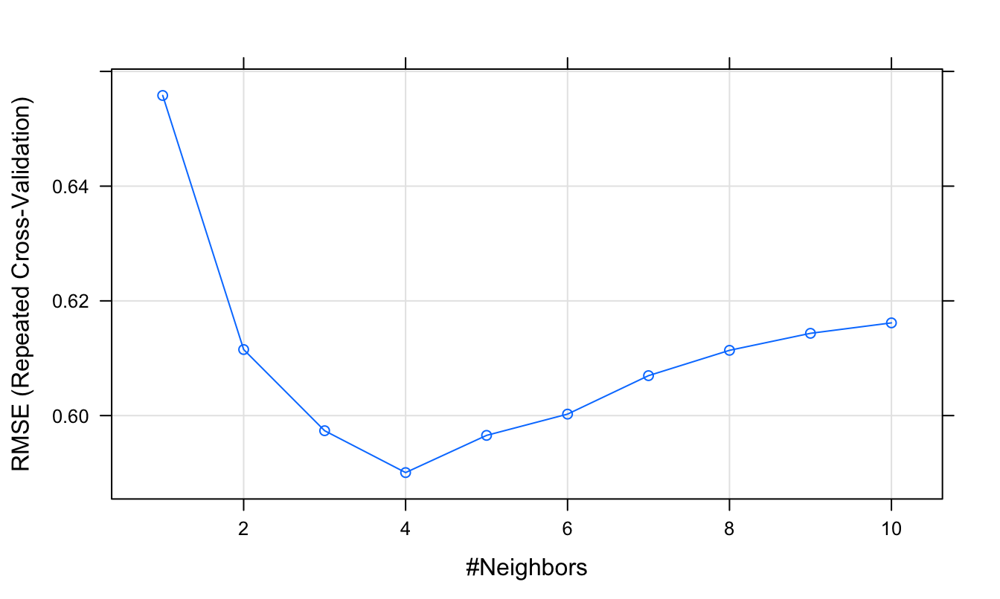

# Nearest neighbours {#nearest-neighbours}

<!-- Matt -->

<!-- 
Get ideas on presentation from Harvard bioinformatics website. In particular, use of dataset with two variables (crabs??), because easier to display. Performance of classifier as k increases (should initially improve and then get worse - starts to lose flexibility).

In exercises could introduce application of knn to regression.

GENERAL:
SPLOM for displaying datasets with small number of variables

FEATURE SELECTION
filter methods  /  wrapper methods / genetic algorithms

Refer to scikit learn

FEATURE SCALING

BIAS-VARIANCE TRADEOFF
In statistics and machine learning, the bias–variance tradeoff (or dilemma) is the problem of simultaneously minimizing two sources of error that prevent supervised learning algorithms from generalizing beyond their training set[citation needed].:

    The bias is error from erroneous assumptions in the learning algorithm. High bias can cause an algorithm to miss the relevant relations between features and target outputs (underfitting).
    The variance is error from sensitivity to small fluctuations in the training set. High variance can cause an algorithm to model the random noise in the training data, rather than the intended outputs (overfitting).


-->
## Introduction
memory based and require no model to be fit

classification and non-linear regression

bias and variance

computational load - finding neighbours and storing the entire training set

k-d tree / linear search

system.time k-d tree search vs linear search

library(class)

class::knn

importance of centering a scaling

increase in neighbours - increase in ties


### Measuring distance between objects

**Euclidean distance:**
\begin{equation}
  distance\left(p,q\right)=\sqrt{\sum_{i=1}^{n} (p_i-q_i)^2}
  (\#eq:euclidean)
\end{equation}


<div class="figure" style="text-align: center">

<p class="caption">(\#fig:euclideanDistanceDiagram)Euclidean distance.</p>
</div>

## Classification

### Algorithm
<div class="figure" style="text-align: center">

<p class="caption">(\#fig:knnClassification)Illustration of _k_-nn classification. In this example we have two classes: blue squares and red triangles. The green circle represents a test object. If k=3 (solid line circle) the test object is assigned to the red triangle class. If k=5 the test object is assigned to the blue square class.  By Antti Ajanki AnAj - Own work, CC BY-SA 3.0, https://commons.wikimedia.org/w/index.php?curid=2170282</p>
</div>

### Simulated data
A simulated data set will be used to demonstrate:

* bias-variance trade-off
* the knn function in R
* plotting decision boundaries
* choosing the optimum value of _k_

The dataset is partitioned into training and test sets.

Load data

```r
load("data/example_binary_classification/bin_class_example.rda")
str(xtrain)
```

```
## 'data.frame':	400 obs. of  2 variables:
##  $ V1: num  -0.223 0.944 2.36 1.846 1.732 ...
##  $ V2: num  -1.153 -0.827 -0.128 2.014 -0.574 ...
```

```r
str(xtest)
```

```
## 'data.frame':	400 obs. of  2 variables:
##  $ V1: num  2.09 2.3 2.07 1.65 1.18 ...
##  $ V2: num  -1.009 1.0947 0.1644 0.3243 -0.0277 ...
```

```r
summary(as.factor(ytrain))
```

```
##   0   1 
## 200 200
```

```r
summary(as.factor(ytest))
```

```
##   0   1 
## 200 200
```


```r
library(ggplot2)
library(GGally)
library(RColorBrewer)
point_shapes <- c(15,17)
point_colours <- brewer.pal(3,"Dark2")
point_size = 2

ggplot(xtrain, aes(V1,V2)) + 
  geom_point(col=point_colours[ytrain+1], shape=point_shapes[ytrain+1], 
             size=point_size) + 
  ggtitle("train") +
  theme_bw() +
  theme(plot.title = element_text(size=25, face="bold"), axis.text=element_text(size=15),
        axis.title=element_text(size=20,face="bold"))

ggplot(xtest, aes(V1,V2)) + 
  geom_point(col=point_colours[ytest+1], shape=point_shapes[ytest+1], 
             size=point_size) + 
  ggtitle("test") +
  theme_bw() +
  theme(plot.title = element_text(size=25, face="bold"), axis.text=element_text(size=15),
        axis.title=element_text(size=20,face="bold"))
```

<div class="figure" style="text-align: center">

<p class="caption">(\#fig:simDataBinClassTrainTest)Scatterplots of the simulated training and test data sets that will be used in the demonstration of binary classification using _k_-nn</p>
</div>


### knn function
For _k_-nn classification and regression we will use the **knn** function in the package **class**.

```r
library(class)
```

**Arguments to knn**

* ```train``` : matrix or data frame of training set cases.
* ```test``` : matrix or data frame of test set cases. A vector will be interpreted as a row vector for a single case.
* ```cl``` : factor of true classifications of training set
* ```k``` : number of neighbours considered.
* ```l``` : minimum vote for definite decision, otherwise doubt. (More precisely, less than k-l dissenting votes are allowed, even if k is increased by ties.)
* ```prob``` : If this is true, the proportion of the votes for the winning class are returned as attribute prob.
* ```use.all``` : controls handling of ties. If true, all distances equal to the kth largest are included. If false, a random selection of distances equal to the kth is chosen to use exactly k neighbours.

Let us perform _k_-nn on the training set with _k_=1. We will use the **confusionMatrix** function from the [caret](http://cran.r-project.org/web/packages/caret/index.html) package to summarize performance of the classifier.

```r
library(caret)
```

```
## Loading required package: lattice
```

```r
knn1train <- class::knn(train=xtrain, test=xtrain, cl=ytrain, k=1)
confusionMatrix(knn1train, ytrain)
```

```
## Confusion Matrix and Statistics
## 
##           Reference
## Prediction   0   1
##          0 200   0
##          1   0 200
##                                      
##                Accuracy : 1          
##                  95% CI : (0.9908, 1)
##     No Information Rate : 0.5        
##     P-Value [Acc > NIR] : < 2.2e-16  
##                                      
##                   Kappa : 1          
##  Mcnemar's Test P-Value : NA         
##                                      
##             Sensitivity : 1.0        
##             Specificity : 1.0        
##          Pos Pred Value : 1.0        
##          Neg Pred Value : 1.0        
##              Prevalence : 0.5        
##          Detection Rate : 0.5        
##    Detection Prevalence : 0.5        
##       Balanced Accuracy : 1.0        
##                                      
##        'Positive' Class : 0          
## 
```
<!--
table(ytrain,knn1train)
cat("KNN prediction error for training set: ", 1-mean(as.numeric(as.vector(knn1train))==ytrain), "\n")
-->

Now let use the training set to predict on the test set.

```r
knn1test <- class::knn(train=xtrain, test=xtest, cl=ytrain, k=1)
confusionMatrix(knn1test, ytest)
```

```
## Confusion Matrix and Statistics
## 
##           Reference
## Prediction   0   1
##          0 131  81
##          1  69 119
##                                           
##                Accuracy : 0.625           
##                  95% CI : (0.5755, 0.6726)
##     No Information Rate : 0.5             
##     P-Value [Acc > NIR] : 3.266e-07       
##                                           
##                   Kappa : 0.25            
##  Mcnemar's Test P-Value : 0.3691          
##                                           
##             Sensitivity : 0.6550          
##             Specificity : 0.5950          
##          Pos Pred Value : 0.6179          
##          Neg Pred Value : 0.6330          
##              Prevalence : 0.5000          
##          Detection Rate : 0.3275          
##    Detection Prevalence : 0.5300          
##       Balanced Accuracy : 0.6250          
##                                           
##        'Positive' Class : 0               
## 
```
<!--
table(ytest, knn1test)
cat("KNN prediction error for test set: ", 1-mean(as.numeric(as.vector(knn1test))==ytest), "\n")
-->

### Plotting decision boundaries
Since we have just two dimensions we can visualize the decision boundary generated by the _k_-nn classifier in a 2D scatterplot. Situations where your original data set contains only two variables will be rare, but it is not unusual to reduce a high-dimensional data set to just two dimensions using the methods that will be discussed in chapter \@ref(dimensionality-reduction). Therefore, knowing how to plot decision boundaries will potentially be helpful for many different datasets and classifiers.

Create a grid so we can predict across the full range of our variables V1 and V2.

```r
gridSize <- 150 
v1limits <- c(min(c(xtrain[,1],xtest[,1])),max(c(xtrain[,1],xtest[,1])))
tmpV1 <- seq(v1limits[1],v1limits[2],len=gridSize)
v2limits <- c(min(c(xtrain[,2],xtest[,2])),max(c(xtrain[,2],xtest[,2])))
tmpV2 <- seq(v2limits[1],v2limits[2],len=gridSize)
xgrid <- expand.grid(tmpV1,tmpV2)
names(xgrid) <- names(xtrain)
```

Predict values of all elements of grid.

```r
knn1grid <- class::knn(train=xtrain, test=xgrid, cl=ytrain, k=1)
V3 <- as.numeric(as.vector(knn1grid))
xgrid <- cbind(xgrid, V3)
```

Plot

```r
point_shapes <- c(15,17)
point_colours <- brewer.pal(3,"Dark2")
point_size = 2

ggplot(xgrid, aes(V1,V2)) +
  geom_point(col=point_colours[knn1grid], shape=16, size=0.3) +
  geom_point(data=xtrain, aes(V1,V2), col=point_colours[ytrain+1],
             shape=point_shapes[ytrain+1], size=point_size) +
  geom_contour(data=xgrid, aes(x=V1, y=V2, z=V3), breaks=0.5, col="grey30") +
  ggtitle("train") +
  theme_bw() +
  theme(plot.title = element_text(size=25, face="bold"), axis.text=element_text(size=15),
        axis.title=element_text(size=20,face="bold"))

ggplot(xgrid, aes(V1,V2)) +
  geom_point(col=point_colours[knn1grid], shape=16, size=0.3) +
  geom_point(data=xtest, aes(V1,V2), col=point_colours[ytest+1],
             shape=point_shapes[ytrain+1], size=point_size) +
  geom_contour(data=xgrid, aes(x=V1, y=V2, z=V3), breaks=0.5, col="grey30") +
  ggtitle("test") +
  theme_bw() +
  theme(plot.title = element_text(size=25, face="bold"), axis.text=element_text(size=15),
        axis.title=element_text(size=20,face="bold"))
```

<div class="figure" style="text-align: center">

<p class="caption">(\#fig:simDataBinClassDecisionBoundaryK1)Binary classification of the simulated training and test sets with _k_=1.</p>
</div>

### Bias-variance tradeoff
The bias–variance tradeoff is the problem of simultaneously minimizing two sources of error that prevent supervised learning algorithms from generalizing beyond their training set:

* The bias is error from erroneous assumptions in the learning algorithm. High bias can cause an algorithm to miss the relevant relations between features and target outputs (underfitting).
* The variance is error from sensitivity to small fluctuations in the training set. High variance can cause an algorithm to model the random noise in the training data, rather than the intended outputs (overfitting).

To demonstrate this phenomenon, let us look at the performance of the _k_-nn classifier over a range of values of _k_.  First we will define a function to create a sequence of log spaced values. This is the **lseq** function from the [emdbook](https://cran.r-project.org/package=emdbook) package:

```r
lseq <- function(from, to, length.out) {
  exp(seq(log(from), log(to), length.out = length.out))
}
```

Get log spaced sequence of length 20, round and then remove any duplicates resulting from rounding.

```r
s <- unique(round(lseq(1,400,20)))
length(s)
```

```
## [1] 19
```


```r
train_error <- sapply(s, function(i){
  yhat <- knn(xtrain, xtrain, ytrain, i)
  return(1-mean(as.numeric(as.vector(yhat))==ytrain))
})

test_error <- sapply(s, function(i){
  yhat <- knn(xtrain, xtest, ytrain, i)
  return(1-mean(as.numeric(as.vector(yhat))==ytest))
})

k <- rep(s, 2)
set <- c(rep("train", length(s)), rep("test", length(s)))
error <- c(train_error, test_error)
misclass_errors <- data.frame(k, set, error)
```


```r
ggplot(misclass_errors, aes(x=k, y=error, group=set)) + 
  geom_line(aes(colour=set, linetype=set), size=1.5) +
  scale_x_log10() +
  ylab("Misclassification Errors") +
  theme_bw() +
  theme(legend.position = c(0.5, 0.25), legend.title=element_blank(),
        legend.text=element_text(size=12), 
        axis.title.x=element_text(face="italic", size=12))
```

<div class="figure" style="text-align: center">

<p class="caption">(\#fig:misclassErrorsFunK)Misclassification errors as a function of neighbourhood size.</p>
</div>

### Choosing _k_

We will use the caret library.

```r
library(caret)
```

[caret](http://cran.r-project.org/web/packages/caret/index.html) has automatic parallel processing built in. To take advantage of this feature we simply need to load the [doMC](http://cran.r-project.org/web/packages/doMC/index.html) package and register workers: 

```r
library(doMC)
```

```
## Loading required package: foreach
```

```
## Loading required package: iterators
```

```
## Loading required package: parallel
```

```r
registerDoMC()
```

To find out how many cores we have registered we can use:

```r
getDoParWorkers()
```

```
## [1] 2
```

The [caret](http://cran.r-project.org/web/packages/caret/index.html) function **train** is used to fit predictive models over different values of _k_. The function **trainControl** is used to specify a list of computational and resampling options, which will be passed to **train**. We will start by configuring our cross-validation procedure using **trainControl**.

We would like to make this demonstration reproducible and because we will be running the models in parallel, using the **set.seed** function alone is not sufficient. In addition to using **set.seed** we have to make use of the optional **seeds** argument to **trainControl**. We need to supply **seeds** with a list of integers that will be used to set the seed at each sampling iteration. The list is required to have a length of B+1, where B is the number of resamples. We will be repeating 10-fold cross-validation a total of ten times and so our list must have a length of 101. The first B elements of the list are required to be vectors of integers of length M, where M is the number of models being evaluated (in this case 19). The last element of the list only needs to be a single integer, which will be used for the final model.

First we generate our list of seeds.

```r
set.seed(42)
seeds <- vector(mode = "list", length = 101)
for(i in 1:100) seeds[[i]] <- sample.int(1000, 19)
seeds[[101]] <- sample.int(1000,1)
```

We can now use **trainControl** to create a list of computational options for resampling.

```r
tc <- trainControl(method="repeatedcv",
                   number = 10,
                   repeats = 10,
                   seeds = seeds)
```

There are two options for choosing the values of _k_ to be evaluated by the **train** function:

1. Pass a data.frame of values of _k_ to the **tuneGrid** argument of **train**.
2. Specify the number of different levels of _k_ using the **tuneLength** function and allow **train** to pick the actual values.

We will use the first option, so that we can try the values of _k_ we examined earlier. We need to convert the vector of values of k we created earlier and convert it into a data.frame.


```r
s <- data.frame(s)
names(s) <- "k"
```

We are now ready to run the cross-validation.

```r
knnFit <- train(xtrain, as.factor(ytrain), 
                method="knn",
                tuneGrid=s,
                trControl=tc)

knnFit
```

```
## k-Nearest Neighbors 
## 
## 400 samples
##   2 predictor
##   2 classes: '0', '1' 
## 
## No pre-processing
## Resampling: Cross-Validated (10 fold, repeated 10 times) 
## Summary of sample sizes: 360, 360, 360, 360, 360, 360, ... 
## Resampling results across tuning parameters:
## 
##   k    Accuracy  Kappa 
##     1  0.63375   0.2675
##     2  0.64125   0.2825
##     3  0.67925   0.3585
##     4  0.67200   0.3440
##     5  0.69675   0.3935
##     7  0.71100   0.4220
##     9  0.71650   0.4330
##    12  0.71450   0.4290
##    17  0.72650   0.4530
##    23  0.73175   0.4635
##    32  0.73775   0.4755
##    44  0.74075   0.4815
##    60  0.74675   0.4935
##    83  0.75475   0.5095
##   113  0.73600   0.4720
##   155  0.72500   0.4500
##   213  0.70950   0.4190
##   292  0.69300   0.3860
##   400  0.51300   0.0260
## 
## Accuracy was used to select the optimal model using  the largest value.
## The final value used for the model was k = 83.
```

**Cohen's Kappa:**
\begin{equation}
  Kappa = \frac{O-E}{1-E}
  (\#eq:kappa)
\end{equation}

where _O_ is the observed accuracy and _E_ is the expected accuracy based on the marginal totals of the confusion matrix. Cohen's Kappa takes values between -1 and 1; a value of zero indicates no agreement between the observed and predicted classes, while a value of one shows perfect concordance of the model prediction and the observed classes. If the prediction is in the opposite direction of the truth, a negative value will be obtained, but large negative values are rare in practice [@Kuhn2013].

We can plot accuracy (determined from repeated cross-validation) as a function of neighbourhood size.

```r
plot(knnFit)
```

<div class="figure" style="text-align: center">

<p class="caption">(\#fig:cvAccuracyFunK)Accuracy (repeated cross-validation) as a function of neighbourhood size.</p>
</div>

We can also plot other performance metrics, such as Cohen's Kappa, using the **metric** argument.

```r
plot(knnFit, metric="Kappa")
```

<div class="figure" style="text-align: center">

<p class="caption">(\#fig:cvKappaFunK)Cohen's Kappa (repeated cross-validation) as a function of neighbourhood size.</p>
</div>

Let us now evaluate how our classifier performs on the test set.

```r
test_pred <- predict(knnFit, xtest)
confusionMatrix(test_pred, ytest)
```

```
## Confusion Matrix and Statistics
## 
##           Reference
## Prediction   0   1
##          0 154  68
##          1  46 132
##                                          
##                Accuracy : 0.715          
##                  95% CI : (0.668, 0.7588)
##     No Information Rate : 0.5            
##     P-Value [Acc > NIR] : <2e-16         
##                                          
##                   Kappa : 0.43           
##  Mcnemar's Test P-Value : 0.0492         
##                                          
##             Sensitivity : 0.7700         
##             Specificity : 0.6600         
##          Pos Pred Value : 0.6937         
##          Neg Pred Value : 0.7416         
##              Prevalence : 0.5000         
##          Detection Rate : 0.3850         
##    Detection Prevalence : 0.5550         
##       Balanced Accuracy : 0.7150         
##                                          
##        'Positive' Class : 0              
## 
```

Scatterplots with decision boundaries can be plotted using the methods described earlier. First create a grid so we can predict across the full range of our variables V1 and V2:

```r
gridSize <- 150 
v1limits <- c(min(c(xtrain[,1],xtest[,1])),max(c(xtrain[,1],xtest[,1])))
tmpV1 <- seq(v1limits[1],v1limits[2],len=gridSize)
v2limits <- c(min(c(xtrain[,2],xtest[,2])),max(c(xtrain[,2],xtest[,2])))
tmpV2 <- seq(v2limits[1],v2limits[2],len=gridSize)
xgrid <- expand.grid(tmpV1,tmpV2)
names(xgrid) <- names(xtrain)
```

Predict values of all elements of grid.

```r
knn1grid <- predict(knnFit, xgrid)
V3 <- as.numeric(as.vector(knn1grid))
xgrid <- cbind(xgrid, V3)
```

Plot

```r
point_shapes <- c(15,17)
point_colours <- brewer.pal(3,"Dark2")
point_size = 2

ggplot(xgrid, aes(V1,V2)) +
  geom_point(col=point_colours[knn1grid], shape=16, size=0.3) +
  geom_point(data=xtrain, aes(V1,V2), col=point_colours[ytrain+1],
             shape=point_shapes[ytrain+1], size=point_size) +
  geom_contour(data=xgrid, aes(x=V1, y=V2, z=V3), breaks=0.5, col="grey30") +
  ggtitle("train") +
  theme_bw() +
  theme(plot.title = element_text(size=25, face="bold"), axis.text=element_text(size=15),
        axis.title=element_text(size=20,face="bold"))

ggplot(xgrid, aes(V1,V2)) +
  geom_point(col=point_colours[knn1grid], shape=16, size=0.3) +
  geom_point(data=xtest, aes(V1,V2), col=point_colours[ytest+1],
             shape=point_shapes[ytrain+1], size=point_size) +
  geom_contour(data=xgrid, aes(x=V1, y=V2, z=V3), breaks=0.5, col="grey30") +
  ggtitle("test") +
  theme_bw() +
  theme(plot.title = element_text(size=25, face="bold"), axis.text=element_text(size=15),
        axis.title=element_text(size=20,face="bold"))
```

<div class="figure" style="text-align: center">

<p class="caption">(\#fig:simDataBinClassDecisionBoundaryK83)Binary classification of the simulated training and test sets with _k_=83.</p>
</div>

### Data pre-processing

#### Cell segmentation data set
Pre-processing will be demonstrated using the cell segmentation data of [@Hill2007]

<div class="figure" style="text-align: center">

<p class="caption">(\#fig:imageSegmentationHCS)Image segmentation in high content screening. Images **b** and **c** are examples of well-segmented cells; **d** and **e** show poor-segmentation. Source: Hill(2007) https://doi.org/10.1186/1471-2105-8-340</p>
</div>

This data set is one of several included in [caret](http://cran.r-project.org/web/packages/caret/index.html).

```r
data(segmentationData)
str(segmentationData)
```

```
## 'data.frame':	2019 obs. of  61 variables:
##  $ Cell                   : int  207827637 207932307 207932463 207932470 207932455 207827656 207827659 207827661 207932479 207932480 ...
##  $ Case                   : Factor w/ 2 levels "Test","Train": 1 2 2 2 1 1 1 1 1 1 ...
##  $ Class                  : Factor w/ 2 levels "PS","WS": 1 1 2 1 1 2 2 1 2 2 ...
##  $ AngleCh1               : num  143.25 133.75 106.65 69.15 2.89 ...
##  $ AreaCh1                : int  185 819 431 298 285 172 177 251 495 384 ...
##  $ AvgIntenCh1            : num  15.7 31.9 28 19.5 24.3 ...
##  $ AvgIntenCh2            : num  4.95 206.88 116.32 102.29 112.42 ...
##  $ AvgIntenCh3            : num  9.55 69.92 63.94 28.22 20.47 ...
##  $ AvgIntenCh4            : num  2.21 164.15 106.7 31.03 40.58 ...
##  $ ConvexHullAreaRatioCh1 : num  1.12 1.26 1.05 1.2 1.11 ...
##  $ ConvexHullPerimRatioCh1: num  0.92 0.797 0.935 0.866 0.957 ...
##  $ DiffIntenDensityCh1    : num  29.5 31.9 32.5 26.7 31.6 ...
##  $ DiffIntenDensityCh3    : num  13.8 43.1 36 22.9 21.7 ...
##  $ DiffIntenDensityCh4    : num  6.83 79.31 51.36 26.39 25.03 ...
##  $ EntropyIntenCh1        : num  4.97 6.09 5.88 5.42 5.66 ...
##  $ EntropyIntenCh3        : num  4.37 6.64 6.68 5.44 5.29 ...
##  $ EntropyIntenCh4        : num  2.72 7.88 7.14 5.78 5.24 ...
##  $ EqCircDiamCh1          : num  15.4 32.3 23.4 19.5 19.1 ...
##  $ EqEllipseLWRCh1        : num  3.06 1.56 1.38 3.39 2.74 ...
##  $ EqEllipseOblateVolCh1  : num  337 2233 802 725 608 ...
##  $ EqEllipseProlateVolCh1 : num  110 1433 583 214 222 ...
##  $ EqSphereAreaCh1        : num  742 3279 1727 1195 1140 ...
##  $ EqSphereVolCh1         : num  1901 17654 6751 3884 3621 ...
##  $ FiberAlign2Ch3         : num  1 1.49 1.3 1.22 1.49 ...
##  $ FiberAlign2Ch4         : num  1 1.35 1.52 1.73 1.38 ...
##  $ FiberLengthCh1         : num  27 64.3 21.1 43.1 34.7 ...
##  $ FiberWidthCh1          : num  7.41 13.17 21.14 7.4 8.48 ...
##  $ IntenCoocASMCh3        : num  0.01118 0.02805 0.00686 0.03096 0.02277 ...
##  $ IntenCoocASMCh4        : num  0.05045 0.01259 0.00614 0.01103 0.07969 ...
##  $ IntenCoocContrastCh3   : num  40.75 8.23 14.45 7.3 15.85 ...
##  $ IntenCoocContrastCh4   : num  13.9 6.98 16.7 13.39 3.54 ...
##  $ IntenCoocEntropyCh3    : num  7.2 6.82 7.58 6.31 6.78 ...
##  $ IntenCoocEntropyCh4    : num  5.25 7.1 7.67 7.2 5.5 ...
##  $ IntenCoocMaxCh3        : num  0.0774 0.1532 0.0284 0.1628 0.1274 ...
##  $ IntenCoocMaxCh4        : num  0.172 0.0739 0.0232 0.0775 0.2785 ...
##  $ KurtIntenCh1           : num  -0.6567 -0.2488 -0.2935 0.6259 0.0421 ...
##  $ KurtIntenCh3           : num  -0.608 -0.331 1.051 0.128 0.952 ...
##  $ KurtIntenCh4           : num  0.726 -0.265 0.151 -0.347 -0.195 ...
##  $ LengthCh1              : num  26.2 47.2 28.1 37.9 36 ...
##  $ NeighborAvgDistCh1     : num  370 174 158 206 205 ...
##  $ NeighborMinDistCh1     : num  99.1 30.1 34.9 33.1 27 ...
##  $ NeighborVarDistCh1     : num  128 81.4 90.4 116.9 111 ...
##  $ PerimCh1               : num  68.8 154.9 84.6 101.1 86.5 ...
##  $ ShapeBFRCh1            : num  0.665 0.54 0.724 0.589 0.6 ...
##  $ ShapeLWRCh1            : num  2.46 1.47 1.33 2.83 2.73 ...
##  $ ShapeP2ACh1            : num  1.88 2.26 1.27 2.55 2.02 ...
##  $ SkewIntenCh1           : num  0.455 0.399 0.472 0.882 0.517 ...
##  $ SkewIntenCh3           : num  0.46 0.62 0.971 1 1.177 ...
##  $ SkewIntenCh4           : num  1.233 0.527 0.325 0.604 0.926 ...
##  $ SpotFiberCountCh3      : int  1 4 2 4 1 1 0 2 1 1 ...
##  $ SpotFiberCountCh4      : num  5 12 7 8 8 5 5 8 12 8 ...
##  $ TotalIntenCh1          : int  2781 24964 11552 5545 6603 53779 43950 4401 7593 6512 ...
##  $ TotalIntenCh2          : num  701 160998 47511 28870 30306 ...
##  $ TotalIntenCh3          : int  1690 54675 26344 8042 5569 21234 20929 4136 6488 7503 ...
##  $ TotalIntenCh4          : int  392 128368 43959 8843 11037 57231 46187 373 24325 23162 ...
##  $ VarIntenCh1            : num  12.5 18.8 17.3 13.8 15.4 ...
##  $ VarIntenCh3            : num  7.61 56.72 37.67 30.01 20.5 ...
##  $ VarIntenCh4            : num  2.71 118.39 49.47 24.75 45.45 ...
##  $ WidthCh1               : num  10.6 32.2 21.2 13.4 13.2 ...
##  $ XCentroid              : int  42 215 371 487 283 191 180 373 236 303 ...
##  $ YCentroid              : int  14 347 252 295 159 127 138 181 467 468 ...
```
The first column of **segmentationData** is a unique identifier for each cell and the second column is a factor indicating how the observations were characterized into training and test sets in the original study; these two variables are irrelevant for the purposes of this demonstration and so can be discarded. 

The third column *Case* contains the class labels: *PS* (poorly-segmented) and *WS* (well-segmented). Columns 4-61 are the 58 measurements available to be used as predictors. Let's put the class labels in a vector and the predictors in their own data.frame.

```r
segClass <- segmentationData$Class
segData <- segmentationData[,4:61]
```

#### Data splitting
The first step in the analysis is to partition the data into training and test sets, using the **createDataPartition** function in [caret](http://cran.r-project.org/web/packages/caret/index.html).

```r
set.seed(42)
trainIndex <- createDataPartition(y=segClass, times=1, p=0.5, list=F)
segDataTrain <- segData[trainIndex,]
segDataTest <- segData[-trainIndex,]
segClassTrain <- segClass[trainIndex]
segClassTest <- segClass[-trainIndex]
```

This results in balanced class distributions within the splits:

```r
summary(segClassTrain)
```

```
##  PS  WS 
## 650 360
```

```r
summary(segClassTest)
```

```
##  PS  WS 
## 650 359
```

_**N.B. The test set is set aside for now. It will be used only ONCE, to test the final model.**_

#### Removal of zero and near zero-variance predictors
The function **nearZeroVar** identifies predictors that have one unique value. It also diagnoses predictors having both of the following characteristics:

* very few unique values relative to the number of samples
* the ratio of the frequency of the most common value to the frequency of the 2nd most common value is large.

Such _zero and near zero-variance predictors_ have a deleterious impact on modelling and may lead to unstable fits.


```r
nzv <- nearZeroVar(segDataTrain, saveMetrics=T)
nzv
```

```
##                         freqRatio percentUnique zeroVar   nzv
## AngleCh1                 1.000000    100.000000   FALSE FALSE
## AreaCh1                  1.083333     37.326733   FALSE FALSE
## AvgIntenCh1              1.000000    100.000000   FALSE FALSE
## AvgIntenCh2              3.000000     99.801980   FALSE FALSE
## AvgIntenCh3              1.000000    100.000000   FALSE FALSE
## AvgIntenCh4              2.000000     99.900990   FALSE FALSE
## ConvexHullAreaRatioCh1   1.000000     98.910891   FALSE FALSE
## ConvexHullPerimRatioCh1  1.000000    100.000000   FALSE FALSE
## DiffIntenDensityCh1      1.000000    100.000000   FALSE FALSE
## DiffIntenDensityCh3      1.000000    100.000000   FALSE FALSE
## DiffIntenDensityCh4      1.000000    100.000000   FALSE FALSE
## EntropyIntenCh1          1.000000    100.000000   FALSE FALSE
## EntropyIntenCh3          1.000000    100.000000   FALSE FALSE
## EntropyIntenCh4          1.000000    100.000000   FALSE FALSE
## EqCircDiamCh1            1.083333     37.326733   FALSE FALSE
## EqEllipseLWRCh1          1.000000    100.000000   FALSE FALSE
## EqEllipseOblateVolCh1    1.000000    100.000000   FALSE FALSE
## EqEllipseProlateVolCh1   1.000000    100.000000   FALSE FALSE
## EqSphereAreaCh1          1.083333     37.326733   FALSE FALSE
## EqSphereVolCh1           1.083333     37.326733   FALSE FALSE
## FiberAlign2Ch3           1.304348     94.950495   FALSE FALSE
## FiberAlign2Ch4           7.285714     94.455446   FALSE FALSE
## FiberLengthCh1           1.000000     95.841584   FALSE FALSE
## FiberWidthCh1            1.000000     95.841584   FALSE FALSE
## IntenCoocASMCh3          1.000000    100.000000   FALSE FALSE
## IntenCoocASMCh4          1.000000    100.000000   FALSE FALSE
## IntenCoocContrastCh3     1.000000    100.000000   FALSE FALSE
## IntenCoocContrastCh4     1.000000    100.000000   FALSE FALSE
## IntenCoocEntropyCh3      1.000000    100.000000   FALSE FALSE
## IntenCoocEntropyCh4      1.000000    100.000000   FALSE FALSE
## IntenCoocMaxCh3          1.250000     94.158416   FALSE FALSE
## IntenCoocMaxCh4          1.250000     94.356436   FALSE FALSE
## KurtIntenCh1             1.000000    100.000000   FALSE FALSE
## KurtIntenCh3             1.000000    100.000000   FALSE FALSE
## KurtIntenCh4             1.000000    100.000000   FALSE FALSE
## LengthCh1                1.000000    100.000000   FALSE FALSE
## NeighborAvgDistCh1       1.000000    100.000000   FALSE FALSE
## NeighborMinDistCh1       1.166667     41.089109   FALSE FALSE
## NeighborVarDistCh1       1.000000    100.000000   FALSE FALSE
## PerimCh1                 1.000000     63.762376   FALSE FALSE
## ShapeBFRCh1              1.000000    100.000000   FALSE FALSE
## ShapeLWRCh1              1.000000    100.000000   FALSE FALSE
## ShapeP2ACh1              1.000000     99.801980   FALSE FALSE
## SkewIntenCh1             1.000000    100.000000   FALSE FALSE
## SkewIntenCh3             1.000000    100.000000   FALSE FALSE
## SkewIntenCh4             1.000000    100.000000   FALSE FALSE
## SpotFiberCountCh3        1.212000      1.287129   FALSE FALSE
## SpotFiberCountCh4        1.152778      3.267327   FALSE FALSE
## TotalIntenCh1            1.000000     98.712871   FALSE FALSE
## TotalIntenCh2            1.500000     99.009901   FALSE FALSE
## TotalIntenCh3            1.000000     99.108911   FALSE FALSE
## TotalIntenCh4            1.000000     99.603960   FALSE FALSE
## VarIntenCh1              1.000000    100.000000   FALSE FALSE
## VarIntenCh3              1.000000    100.000000   FALSE FALSE
## VarIntenCh4              1.000000    100.000000   FALSE FALSE
## WidthCh1                 1.000000    100.000000   FALSE FALSE
## XCentroid                1.111111     41.584158   FALSE FALSE
## YCentroid                1.000000     35.742574   FALSE FALSE
```

#### Centring and scaling
The variables in this data set are on different scales, for example:

```r
summary(segDataTrain$IntenCoocASMCh4)
```

```
##     Min.  1st Qu.   Median     Mean  3rd Qu.     Max. 
## 0.004874 0.017250 0.049460 0.101600 0.121200 0.867800
```

```r
summary(segDataTrain$TotalIntenCh2)
```

```
##    Min. 1st Qu.  Median    Mean 3rd Qu.    Max. 
##       1   15850   49650   53140   72300  362500
```

In this situation it is important to centre and scale each predictor. A predictor variable is centered by subtracting the mean of the predictor from each value. To scale a predictor variable, each value is divided by its standard deviation. After centring and scaling the predictor variable has a mean of 0 and a standard deviation of 1. Centring and scaling will be peformed within the cross-validation process.


#### Resolving skewness
Many of the predictors in the segmentation data set exhibit skewness, _i.e._ the distribution of their values is asymmetric, for example:

```r
qplot(segDataTrain$IntenCoocASMCh3, binwidth=0.1) + 
  xlab("IntenCoocASMCh3") +
  theme_bw()
```

<div class="figure" style="text-align: center">

<p class="caption">(\#fig:segDataSkewness)Example of a predictor from the segmentation data set showing skewness.</p>
</div>

[caret](http://cran.r-project.org/web/packages/caret/index.html) provides various methods for transforming skewed variables to normality, including the Box-Cox [@BoxCox] and Yeo-Johnson [@YeoJohnson] transformations.

#### Removal of correlated predictors

Many of the variables in the segmentation data set are highly correlated.


```r
library(corrplot)
corMat <- cor(segDataTrain)
corrplot(corMat, order="hclust", tl.cex=0.4)
```

<div class="figure" style="text-align: center">

<p class="caption">(\#fig:segDataCorrelogram)Correlogram of the segmentation data set.</p>
</div>

The **preProcess** function in [caret](http://cran.r-project.org/web/packages/caret/index.html) has an option, **corr** to remove highly correlated variables. It considers the absolute values of pair-wise correlations. If two variables are highly correlated, **preProcess** looks at the mean absolute correlation of each variable and removes the variable with the largest mean absolute correlation.

<!--

```r
highCorr <- findCorrelation(corMat, cutoff=0.75)
length(highCorr)
```

```
## [1] 31
```

```r
segDataTrain <- segDataTrain[,-highCorr]
```
-->

#### Dimensionality reduction
In the case of data-sets comprised of many highly correlated variables, an alternative to removing correlated predictors is the transformation of the entire data set to a lower dimensional space, using a technique such as principal component analysis (PCA). Methods for dimensionality reduction will be explored in chapter \@ref(dimensionality-reduction).


### Feature selection

wrapper and filter methods

#### Cross-validated performance without feature selection

<!-- original settings:
set.seed(42)
seeds <- vector(mode = "list", length = 101)
for(i in 1:100) seeds[[i]] <- sample.int(1000, 50)
seeds[[101]] <- sample.int(1000,1)
-->
Generate a list of seeds.

```r
set.seed(42)
seeds <- vector(mode = "list", length = 26)
for(i in 1:25) seeds[[i]] <- sample.int(1000, 50)
seeds[[26]] <- sample.int(1000,1)
```

Create a list of computational options for resampling. In the interest of speed for this demonstration, we will perform 5-fold cross-validation a total of 5 times. In practice we would use a larger number of folds and repetitions.

```r
train_ctrl <- trainControl(method="repeatedcv",
                   number = 5,
                   repeats = 5,
                   #preProcOptions=list(cutoff=0.75),
                   seeds = seeds)
```

Create a grid of values of _k_ for evaluation.

```r
tuneParam <- data.frame(k=seq(5,500,10))
```

To deal with the issues of scaling, skewness and highly correlated predictors identified earlier, we need to pre-process the data. We will use the Yeo-Johnson transformation to reduce skewness, because it can deal with the zero values present in some of the predictors. Ideally the pre-processing procedures would be performed within each cross-validation loop, using the following command:
```
knnFit <- train(segDataTrain, segClassTrain, 
                method="knn",
                preProcess = c("YeoJohnson", "center", "scale", "corr"),
                tuneGrid=tuneParam,
                trControl=train_ctrl)
```

However, this is time-consuming, so for the purposes of this demonstration we will pre-process the entire training data-set before proceeding with training and cross-validation.

```r
transformations <- preProcess(segDataTrain, 
                              method=c("YeoJohnson", "center", "scale", "corr"),
                              cutoff=0.75)
segDataTrain <- predict(transformations, segDataTrain)
```


```r
str(segDataTrain)
```

```
## 'data.frame':	1010 obs. of  27 variables:
##  $ AngleCh1               : num  1.045 0.873 -0.376 -0.994 1.586 ...
##  $ ConvexHullPerimRatioCh1: num  0.12 -1.34 -0.68 1.81 1.56 ...
##  $ EntropyIntenCh1        : num  -2.443 -0.671 -1.688 0.554 0.425 ...
##  $ EqEllipseOblateVolCh1  : num  -0.414 1.693 0.711 -1.817 -1.667 ...
##  $ FiberAlign2Ch3         : num  -1.8124 0.0933 -0.9679 -0.6188 -0.8721 ...
##  $ FiberAlign2Ch4         : num  -1.729 -0.331 1.255 -0.291 0.463 ...
##  $ FiberWidthCh1          : num  -0.776 0.878 -0.779 0.712 0.758 ...
##  $ IntenCoocASMCh4        : num  -0.181 -1.036 -1.079 -1.131 -1.155 ...
##  $ IntenCoocContrastCh3   : num  2.4777 0.0604 -0.0816 0.0634 0.6386 ...
##  $ IntenCoocContrastCh4   : num  1.101 0.127 1.046 0.602 1.445 ...
##  $ IntenCoocMaxCh3        : num  -0.815 -0.232 -0.168 -1.366 -1.37 ...
##  $ KurtIntenCh1           : num  -0.97 -0.26 0.562 -0.187 0.296 ...
##  $ KurtIntenCh3           : num  -1.506 -1.133 -0.672 -1.908 -1.491 ...
##  $ KurtIntenCh4           : num  0.68399 -0.00329 -0.09737 -0.1679 -0.79044 ...
##  $ NeighborAvgDistCh1     : num  2.5376 -1.4791 -0.5357 0.1062 0.0663 ...
##  $ NeighborMinDistCh1     : num  3.286 0.289 0.557 -1.679 -1.679 ...
##  $ ShapeBFRCh1            : num  0.648 -0.609 -0.141 0.89 1.593 ...
##  $ ShapeLWRCh1            : num  1.23 -0.351 1.525 -1.832 -1.717 ...
##  $ SkewIntenCh1           : num  -0.213 -0.297 0.384 -2.41 -2.678 ...
##  $ SpotFiberCountCh3      : num  -0.366 1.275 1.275 -0.366 -1.573 ...
##  $ TotalIntenCh2          : num  -1.701 1.682 -0.233 1.107 1.019 ...
##  $ VarIntenCh1            : num  -2.118 -1.346 -1.917 1.062 0.856 ...
##  $ VarIntenCh3            : num  -1.9155 -0.1836 -0.8001 0.0478 -0.3659 ...
##  $ VarIntenCh4            : num  -2.304 0.332 -1.092 0.843 0.387 ...
##  $ WidthCh1               : num  -1.626 1.845 -0.718 -0.188 -0.333 ...
##  $ XCentroid              : num  -1.647 -0.241 1.484 -0.412 -0.492 ...
##  $ YCentroid              : num  -2.098 1.447 1.118 -0.251 -0.138 ...
```


```r
knnFit <- train(segDataTrain, segClassTrain, 
                method="knn",
                tuneGrid=tuneParam,
                trControl=train_ctrl)
knnFit
```

```
## k-Nearest Neighbors 
## 
## 1010 samples
##   27 predictor
##    2 classes: 'PS', 'WS' 
## 
## No pre-processing
## Resampling: Cross-Validated (5 fold, repeated 5 times) 
## Summary of sample sizes: 808, 808, 808, 808, 808, 808, ... 
## Resampling results across tuning parameters:
## 
##   k    Accuracy   Kappa    
##     5  0.7906931  0.5483969
##    15  0.8083168  0.5888506
##    25  0.8100990  0.5924026
##    35  0.8079208  0.5865236
##    45  0.8063366  0.5814528
##    55  0.8015842  0.5719387
##    65  0.8007921  0.5701690
##    75  0.7990099  0.5651716
##    85  0.8011881  0.5697020
##    95  0.8019802  0.5701985
##   105  0.8019802  0.5704087
##   115  0.8015842  0.5687150
##   125  0.8015842  0.5684810
##   135  0.7998020  0.5637078
##   145  0.8001980  0.5636599
##   155  0.7988119  0.5595799
##   165  0.7972277  0.5560380
##   175  0.7970297  0.5555436
##   185  0.7978218  0.5567664
##   195  0.7974257  0.5554857
##   205  0.7974257  0.5548076
##   215  0.7966337  0.5520418
##   225  0.7958416  0.5492238
##   235  0.7952475  0.5476906
##   245  0.7942574  0.5444892
##   255  0.7956436  0.5471174
##   265  0.7990099  0.5530818
##   275  0.7978218  0.5491339
##   285  0.7966337  0.5449844
##   295  0.7966337  0.5441319
##   305  0.7950495  0.5399876
##   315  0.7940594  0.5361108
##   325  0.7926733  0.5313431
##   335  0.7891089  0.5212114
##   345  0.7855446  0.5104797
##   355  0.7845545  0.5062078
##   365  0.7835644  0.5018507
##   375  0.7800000  0.4912488
##   385  0.7766337  0.4812860
##   395  0.7693069  0.4597910
##   405  0.7615842  0.4346654
##   415  0.7538614  0.4098402
##   425  0.7497030  0.3933898
##   435  0.7415842  0.3657612
##   445  0.7330693  0.3385091
##   455  0.7239604  0.3061210
##   465  0.7182178  0.2829231
##   475  0.7156436  0.2691460
##   485  0.7057426  0.2347579
##   495  0.6966337  0.2017917
## 
## Accuracy was used to select the optimal model using  the largest value.
## The final value used for the model was k = 25.
```


```r
plot(knnFit)
```

<div class="figure" style="text-align: center">

<p class="caption">(\#fig:cvAccuracySegDataHighCorRem)Accuracy (repeated cross-validation) as a function of neighbourhood size for the segmentation training data with highly correlated predictors removed.</p>
</div>


#### Univariate (_t_-test) filter
We will use the same **trainingControl** settings and **tuning grid** as before. 

```r
train_ctrl <- trainControl(method="repeatedcv",
                   number = 5,
                   repeats = 5
                   )

mySBF <- caretSBF
mySBF$summary <- twoClassSummary
mySBF$score <- function(x, y) {
  out <- t.test(x ~ y)$p.value 
  out <- p.adjust(out, method="holm")
  out
}
mySBF$filter <- function(score, x, y) { score <= 0.01 }

sbf_ctrl <- sbfControl(functions = mySBF,
                                method = "repeatedcv",
                                number = 5,
                                repeats = 5,
                                verbose = FALSE)

knn_sbf <- sbf(segDataTrain,
                segClassTrain,
                trControl = train_ctrl,
                sbfControl = sbf_ctrl,
                ## now arguments to `train`:
                method = "knn",
                tuneGrid = tuneParam)
knn_sbf
```

```
## 
## Selection By Filter
## 
## Outer resampling method: Cross-Validated (5 fold, repeated 5 times) 
## 
## Resampling performance:
## 
##     ROC   Sens   Spec   ROCSD  SensSD  SpecSD
##  0.8826 0.8298 0.7672 0.02181 0.03119 0.05828
## 
## Using the training set, 16 variables were selected:
##    ConvexHullPerimRatioCh1, EntropyIntenCh1, FiberWidthCh1, IntenCoocASMCh4, IntenCoocContrastCh3...
## 
## During resampling, the top 5 selected variables (out of a possible 19):
##    ConvexHullPerimRatioCh1 (100%), EntropyIntenCh1 (100%), FiberWidthCh1 (100%), IntenCoocASMCh4 (100%), IntenCoocContrastCh3 (100%)
## 
## On average, 15.6 variables were selected (min = 15, max = 17)
```

Much information about the final model is stored in **knn_sbf**. To reveal the identities of the predictors selected for the final model run:

```r
knn_sbf$optVariables
```

```
##  [1] "ConvexHullPerimRatioCh1" "EntropyIntenCh1"        
##  [3] "FiberWidthCh1"           "IntenCoocASMCh4"        
##  [5] "IntenCoocContrastCh3"    "IntenCoocMaxCh3"        
##  [7] "KurtIntenCh1"            "KurtIntenCh3"           
##  [9] "KurtIntenCh4"            "ShapeBFRCh1"            
## [11] "ShapeLWRCh1"             "SkewIntenCh1"           
## [13] "TotalIntenCh2"           "VarIntenCh1"            
## [15] "VarIntenCh4"             "WidthCh1"
```

Here are some performance metrics for the final model:

```r
knn_sbf$results
```

```
##         ROC      Sens      Spec      ROCSD    SensSD     SpecSD
## 1 0.8825705 0.8298462 0.7672222 0.02181001 0.0311926 0.05827819
```

To retrieve the optimum value of k found during training run:

```r
knn_sbf$fit$finalModel$k
```

```
## [1] 15
```

Let's test the final model.

```r
segDataTest <- predict(transformations, segDataTest)
test_pred <- predict(knn_sbf, segDataTest)
confusionMatrix(test_pred$pred, segClassTest)
```

```
## Confusion Matrix and Statistics
## 
##           Reference
## Prediction  PS  WS
##         PS 536  99
##         WS 114 260
##                                           
##                Accuracy : 0.7889          
##                  95% CI : (0.7624, 0.8137)
##     No Information Rate : 0.6442          
##     P-Value [Acc > NIR] : <2e-16          
##                                           
##                   Kappa : 0.5438          
##  Mcnemar's Test P-Value : 0.3374          
##                                           
##             Sensitivity : 0.8246          
##             Specificity : 0.7242          
##          Pos Pred Value : 0.8441          
##          Neg Pred Value : 0.6952          
##              Prevalence : 0.6442          
##          Detection Rate : 0.5312          
##    Detection Prevalence : 0.6293          
##       Balanced Accuracy : 0.7744          
##                                           
##        'Positive' Class : PS              
## 
```


## Regression

_k_-nn can also be applied to the problem of regression as we will see in the following example. The **BloodBrain** dataset in the [caret](http://cran.r-project.org/web/packages/caret/index.html) package contains data on 208 chemical compounds, organized in two objects:

* **logBBB** - a vector of the log ratio of the concentration of a chemical compound in the brain and the concentration in the blood.
* **bbbDescr** - a data frame of 134 molecular descriptors of the compounds.

We'll start by loading the data.

```r
data(BloodBrain)
str(bbbDescr)
```

```
## 'data.frame':	208 obs. of  134 variables:
##  $ tpsa                : num  12 49.3 50.5 37.4 37.4 ...
##  $ nbasic              : int  1 0 1 0 1 1 1 1 1 1 ...
##  $ negative            : int  0 0 0 0 0 0 0 0 0 0 ...
##  $ vsa_hyd             : num  167.1 92.6 295.2 319.1 299.7 ...
##  $ a_aro               : int  0 6 15 15 12 11 6 12 12 6 ...
##  $ weight              : num  156 151 366 383 326 ...
##  $ peoe_vsa.0          : num  76.9 38.2 58.1 62.2 74.8 ...
##  $ peoe_vsa.1          : num  43.4 25.5 124.7 124.7 118 ...
##  $ peoe_vsa.2          : num  0 0 21.7 13.2 33 ...
##  $ peoe_vsa.3          : num  0 8.62 8.62 21.79 0 ...
##  $ peoe_vsa.4          : num  0 23.3 17.4 0 0 ...
##  $ peoe_vsa.5          : num  0 0 0 0 0 0 0 0 0 0 ...
##  $ peoe_vsa.6          : num  17.24 0 8.62 8.62 8.62 ...
##  $ peoe_vsa.0.1        : num  18.7 49 83.8 83.8 83.8 ...
##  $ peoe_vsa.1.1        : num  43.5 0 49 68.8 36.8 ...
##  $ peoe_vsa.2.1        : num  0 0 0 0 0 ...
##  $ peoe_vsa.3.1        : num  0 0 0 0 0 0 0 0 0 0 ...
##  $ peoe_vsa.4.1        : num  0 0 5.68 5.68 5.68 ...
##  $ peoe_vsa.5.1        : num  0 13.567 2.504 0 0.137 ...
##  $ peoe_vsa.6.1        : num  0 7.9 2.64 2.64 2.5 ...
##  $ a_acc               : int  0 2 2 2 2 2 2 2 0 2 ...
##  $ a_acid              : int  0 0 0 0 0 0 0 0 0 0 ...
##  $ a_base              : int  1 0 1 1 1 1 1 1 1 1 ...
##  $ vsa_acc             : num  0 13.57 8.19 8.19 8.19 ...
##  $ vsa_acid            : num  0 0 0 0 0 0 0 0 0 0 ...
##  $ vsa_base            : num  5.68 0 0 0 0 ...
##  $ vsa_don             : num  5.68 5.68 5.68 5.68 5.68 ...
##  $ vsa_other           : num  0 28.1 43.6 28.3 19.6 ...
##  $ vsa_pol             : num  0 13.6 0 0 0 ...
##  $ slogp_vsa0          : num  18 25.4 14.1 14.1 14.1 ...
##  $ slogp_vsa1          : num  0 23.3 34.8 34.8 34.8 ...
##  $ slogp_vsa2          : num  3.98 23.86 0 0 0 ...
##  $ slogp_vsa3          : num  0 0 76.2 76.2 76.2 ...
##  $ slogp_vsa4          : num  4.41 0 3.19 3.19 3.19 ...
##  $ slogp_vsa5          : num  32.9 0 9.51 0 0 ...
##  $ slogp_vsa6          : num  0 0 0 0 0 0 0 0 0 0 ...
##  $ slogp_vsa7          : num  0 70.6 148.1 144 140.7 ...
##  $ slogp_vsa8          : num  113.2 0 75.5 75.5 75.5 ...
##  $ slogp_vsa9          : num  33.3 41.3 28.3 55.5 26 ...
##  $ smr_vsa0            : num  0 23.86 12.63 3.12 3.12 ...
##  $ smr_vsa1            : num  18 25.4 27.8 27.8 27.8 ...
##  $ smr_vsa2            : num  4.41 0 0 0 0 ...
##  $ smr_vsa3            : num  3.98 5.24 8.43 8.43 8.43 ...
##  $ smr_vsa4            : num  0 20.8 29.6 21.4 20.3 ...
##  $ smr_vsa5            : num  113.2 70.6 235.1 235.1 234.6 ...
##  $ smr_vsa6            : num  0 5.26 76.25 76.25 76.25 ...
##  $ smr_vsa7            : num  66.2 33.3 0 31.3 0 ...
##  $ tpsa.1              : num  16.6 49.3 51.7 38.6 38.6 ...
##  $ logp.o.w.           : num  2.948 0.889 4.439 5.254 3.8 ...
##  $ frac.anion7.        : num  0 0.001 0 0 0 0 0.001 0 0 0 ...
##  $ frac.cation7.       : num  0.999 0 0.986 0.986 0.986 0.986 0.996 0.946 0.999 0.976 ...
##  $ andrewbind          : num  3.4 -3.3 12.8 12.8 10.3 10 10.4 15.9 12.9 9.5 ...
##  $ rotatablebonds      : int  3 2 8 8 8 8 8 7 4 5 ...
##  $ mlogp               : num  2.5 1.06 4.66 3.82 3.27 ...
##  $ clogp               : num  2.97 0.494 5.137 5.878 4.367 ...
##  $ mw                  : num  155 151 365 382 325 ...
##  $ nocount             : int  1 3 5 4 4 4 4 3 2 4 ...
##  $ hbdnr               : int  1 2 1 1 1 1 2 1 1 0 ...
##  $ rule.of.5violations : int  0 0 1 1 0 0 0 0 1 0 ...
##  $ alert               : int  0 0 0 0 0 0 0 0 0 0 ...
##  $ prx                 : int  0 1 6 2 2 2 1 0 0 4 ...
##  $ ub                  : num  0 3 5.3 5.3 4.2 3.6 3 4.7 4.2 3 ...
##  $ pol                 : int  0 2 3 3 2 2 2 3 4 1 ...
##  $ inthb               : int  0 0 0 0 0 0 1 0 0 0 ...
##  $ adistm              : num  0 395 1365 703 746 ...
##  $ adistd              : num  0 10.9 25.7 10 10.6 ...
##  $ polar_area          : num  21.1 117.4 82.1 65.1 66.2 ...
##  $ nonpolar_area       : num  379 248 638 668 602 ...
##  $ psa_npsa            : num  0.0557 0.4743 0.1287 0.0974 0.11 ...
##  $ tcsa                : num  0.0097 0.0134 0.0111 0.0108 0.0118 0.0111 0.0123 0.0099 0.0106 0.0115 ...
##  $ tcpa                : num  0.1842 0.0417 0.0972 0.1218 0.1186 ...
##  $ tcnp                : num  0.0103 0.0198 0.0125 0.0119 0.013 0.0125 0.0162 0.011 0.0109 0.0122 ...
##  $ ovality             : num  1.1 1.12 1.3 1.3 1.27 ...
##  $ surface_area        : num  400 365 720 733 668 ...
##  $ volume              : num  656 555 1224 1257 1133 ...
##  $ most_negative_charge: num  -0.617 -0.84 -0.801 -0.761 -0.857 ...
##  $ most_positive_charge: num  0.307 0.497 0.541 0.48 0.455 ...
##  $ sum_absolute_charge : num  3.89 4.89 7.98 7.93 7.85 ...
##  $ dipole_moment       : num  1.19 4.21 3.52 3.15 3.27 ...
##  $ homo                : num  -9.67 -8.96 -8.63 -8.56 -8.67 ...
##  $ lumo                : num  3.4038 0.1942 0.0589 -0.2651 0.3149 ...
##  $ hardness            : num  6.54 4.58 4.34 4.15 4.49 ...
##  $ ppsa1               : num  349 223 518 508 509 ...
##  $ ppsa2               : num  679 546 2066 2013 1999 ...
##  $ ppsa3               : num  31 42.3 64 61.7 61.6 ...
##  $ pnsa1               : num  51.1 141.8 202 225.4 158.8 ...
##  $ pnsa2               : num  -99.3 -346.9 -805.9 -894 -623.3 ...
##  $ pnsa3               : num  -10.5 -44 -43.8 -42 -39.8 ...
##  $ fpsa1               : num  0.872 0.611 0.719 0.693 0.762 ...
##  $ fpsa2               : num  1.7 1.5 2.87 2.75 2.99 ...
##  $ fpsa3               : num  0.0774 0.1159 0.0888 0.0842 0.0922 ...
##  $ fnsa1               : num  0.128 0.389 0.281 0.307 0.238 ...
##  $ fnsa2               : num  -0.248 -0.951 -1.12 -1.22 -0.933 ...
##  $ fnsa3               : num  -0.0262 -0.1207 -0.0608 -0.0573 -0.0596 ...
##  $ wpsa1               : num  139.7 81.4 372.7 372.1 340.1 ...
##  $ wpsa2               : num  272 199 1487 1476 1335 ...
##  $ wpsa3               : num  12.4 15.4 46 45.2 41.1 ...
##  $ wnsa1               : num  20.4 51.8 145.4 165.3 106 ...
##  $ wnsa2               : num  -39.8 -126.6 -580.1 -655.3 -416.3 ...
##   [list output truncated]
```

```r
str(logBBB)
```

```
##  num [1:208] 1.08 -0.4 0.22 0.14 0.69 0.44 -0.43 1.38 0.75 0.88 ...
```
Evidently the variables are on different scales which is problematic for _k_-nn.

### Partition data
Before proceeding the data set must be partitioned into a training and a test set.

```r
set.seed(42)
trainIndex <- createDataPartition(y=logBBB, times=1, p=0.8, list=F)
descrTrain <- bbbDescr[trainIndex,]
concRatioTrain <- logBBB[trainIndex]
descrTest <- bbbDescr[-trainIndex,]
concRatioTest <- logBBB[-trainIndex]
```

### Data pre-processing
Are there any issues with the data that might affect model fitting? Let's start by considering correlation.


```r
cm <- cor(descrTrain)
corrplot(cm, order="hclust", tl.pos="n")
```

<div class="figure" style="text-align: center">

<p class="caption">(\#fig:compoundDescriptorsCorrelogram)Correlogram of the chemical compound descriptors.</p>
</div>

The number of variables exhibiting a pair-wise correlation coefficient above 0.75 can be determined:

```r
highCorr <- findCorrelation(cm, cutoff=0.75)
length(highCorr)
```

```
## [1] 68
```

A check for the presence of missing values:

```r
anyNA(descrTrain)
```

```
## [1] FALSE
```

Detection of near zero variance predictors:

```r
nearZeroVar(descrTrain)
```

```
## [1]  3 16 22 25 50 60
```

We know there are issues with scaling, and the presence of highly correlated predictors and near zero variance predictors. These problems are resolved by pre-processing. First we define the procesing steps.

```r
transformations <- preProcess(descrTrain,
                              method=c("center", "scale", "corr", "nzv"),
                              cutoff=0.75)
```
Then this transformation can be applied to the compound descriptor data set.

```r
descrTrain <- predict(transformations, descrTrain)
```

### Search for optimum _k_
The optimum value of _k_ can be found by cross-validation, following similar methodology to that used to find the best _k_ for classification. We'll start by generating seeds to make this example reproducible.

```r
set.seed(42)
seeds <- vector(mode = "list", length = 26)
for(i in 1:25) seeds[[i]] <- sample.int(1000, 50)
seeds[[26]] <- sample.int(1000,1)
```

Ten values of _k_ will be evaluated using 5 repeats of 5-fold cross-validation.

```r
knnTune <- train(descrTrain,
                 concRatioTrain,
                 method="knn",
                 tuneGrid = data.frame(.k=1:10),
                 trControl = trainControl(method="repeatedcv",
                                          number = 5,
                                          repeats = 5,
                                          seeds=seeds,
                                          preProcOptions=list(cutoff=0.75))
                 )

knnTune
```

```
## k-Nearest Neighbors 
## 
## 168 samples
##  61 predictor
## 
## No pre-processing
## Resampling: Cross-Validated (5 fold, repeated 5 times) 
## Summary of sample sizes: 134, 133, 134, 135, 136, 135, ... 
## Resampling results across tuning parameters:
## 
##   k   RMSE       Rsquared 
##    1  0.6558057  0.3842540
##    2  0.6115146  0.4078611
##    3  0.5973631  0.4175457
##    4  0.5900643  0.4209210
##    5  0.5965506  0.4048469
##    6  0.6002566  0.3947480
##    7  0.6069634  0.3847001
##    8  0.6113786  0.3763523
##    9  0.6143439  0.3720127
##   10  0.6161641  0.3718038
## 
## RMSE was used to select the optimal model using  the smallest value.
## The final value used for the model was k = 4.
```

The Root Mean Squared Error (RMSE) measures the differences between the values predicted by the model and the values actually observed. More specifically, it represents the sample standard deviation of the difference between the predicted values and observed values. 

```r
plot(knnTune)
```

<div class="figure" style="text-align: center">

<p class="caption">(\#fig:rmseFunK)Root Mean Squared Error as a function of neighbourhood size.</p>
</div>

### Use model to make predictions
Before attempting to predict the blood/brain concentration ratios of the test samples, the descriptors in the test set must be transformed using the same pre-processing procedure that was applied to the descriptors in the training set.

```r
descrTest <- predict(transformations, descrTest)
```

Use model to predict outcomes (concentration ratios) of the test set.

```r
test_pred <- predict(knnTune, descrTest)
```

Prediction performance can be visualized in a scatterplot.


```r
qplot(concRatioTest, test_pred) + 
  xlab("observed") +
  ylab("predicted") +
  theme_bw()
```

<div class="figure" style="text-align: center">

<p class="caption">(\#fig:obsPredConcRatios)Concordance between observed concentration ratios and those predicted by _k_-nn regression.</p>
</div>

We can also measure correlation between observed and predicted values.

```r
cor(concRatioTest, test_pred)
```

```
## [1] 0.7278034
```

<!--
## Caret

pre-processing
identification of correlated predictors


Parallel processing with doMC
registerDoMC()
getDoParWorkers()

## Curse of dimensionality
Pre-processing data using dimensionality reduction.

transformation functionality in caret

## Examples

centre1 <- read.csv("data/serum_proteomics/male_centre1.csv")
centre2 <- read.csv("data/serum_proteomics/male_centre2.csv")

c1sub <- centre1[,c(1,5,6,9,10)]
c2sub <- centre2[,c(1,5,6,9,10)]

res <- FNN::knn(c1sub[,2:5], c1sub[,2:5], cl=c1sub$Diagnostic_group, k=1)
table(c1sub$Diagnostic_group, res)

res <- FNN::knn(c1sub[,2:5], c2sub[,2:5], cl=c1sub$Diagnostic_group, k=1)
table(c2sub$Diagnostic_group, res)

bias / variance trade-off

include:
division into training and test set
preprocessing - illustrate with diagram

-->


## Exercises

### Exercise 1 {#knnEx1}
Classification

Try different methods of feature selection

### Exercise 2 {#knnEx2}
Regression

Alzheimers & gene expression? MMSE and gene expression?


Solutions to exercises can be found in appendix \@ref(solutions-nearest-neighbours).
