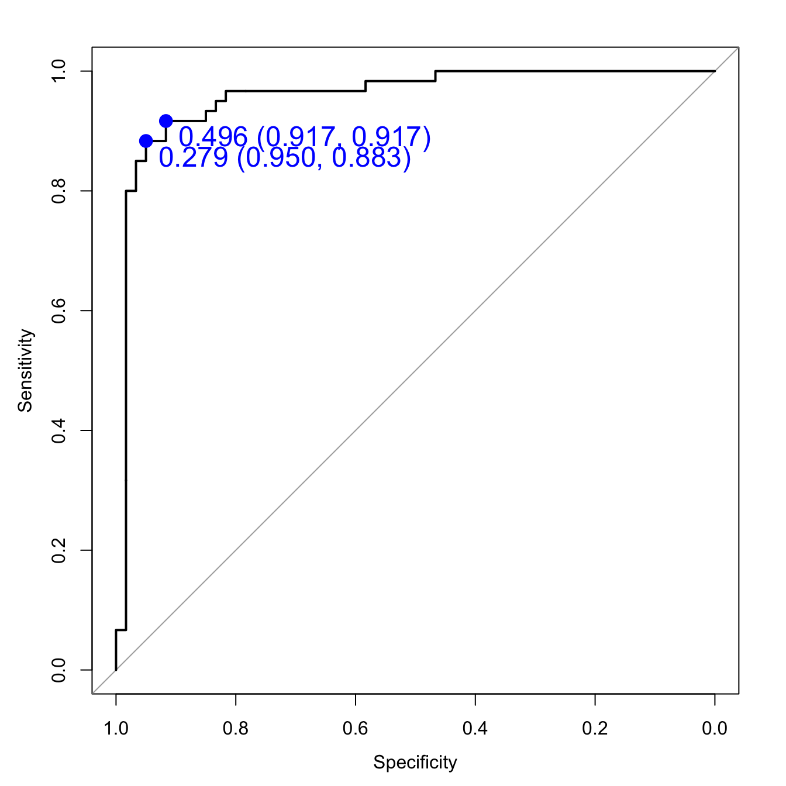
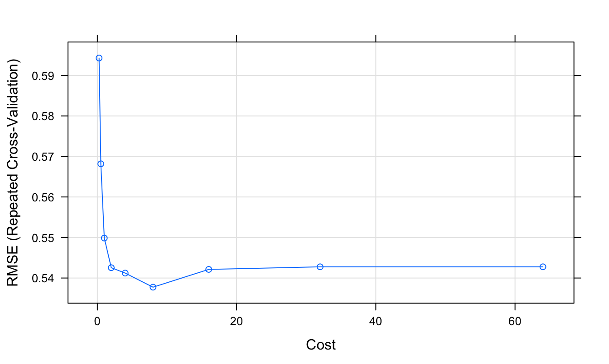
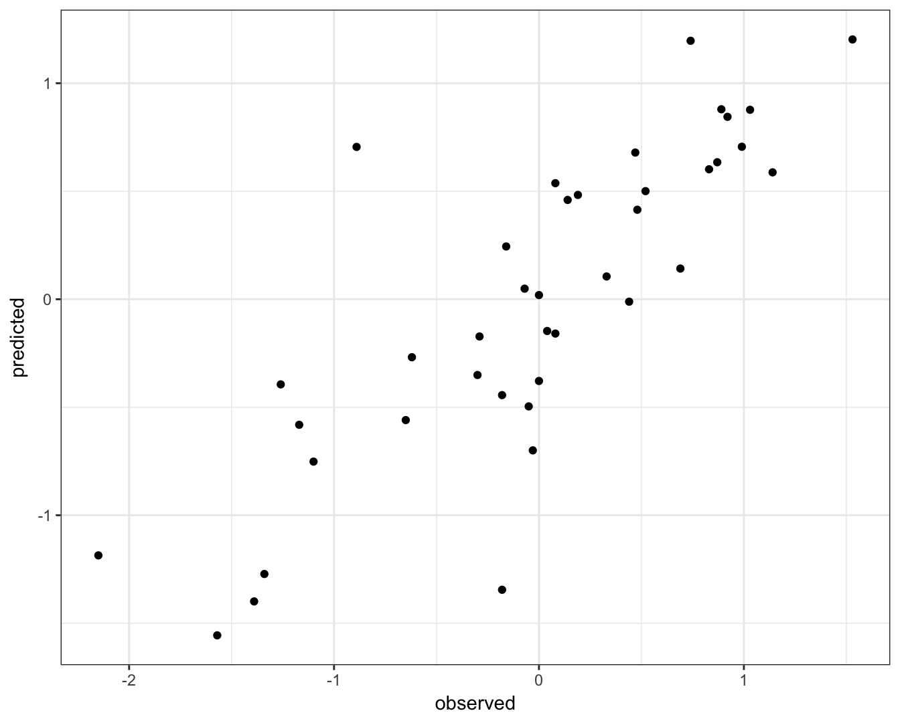

# Support vector machines {#svm}

## Introduction
Support vector machines (SVMs) are models of supervised learning, applicable to both classification and regression problems. The SVM is an extension of the support vector classifier (SVC), which is turn is an extension of the maximum margin classifier. 

### Maximum margin classifier
Let's start by definining a hyperplane. In _p_-dimensional space a hyperplane is a flat affine subspace of _p_-1. 

<div class="figure" style="text-align: center">

<p class="caption">(\#fig:svmSeparatingHyperplanes)Separating hyperplanes. H1 does not separate the classes. H2 does, but only with a small margin. H3 separates them with the maximum margin. By User:ZackWeinberg, based on PNG version by User:Cyc [CC BY-SA 3.0 (https://creativecommons.org/licenses/by-sa/3.0)], via Wikimedia Commons</p>
</div>


<div class="figure" style="text-align: center">

<p class="caption">(\#fig:svmMaxSepHyperplaneWithMargin)Maximum-margin hyperplane and margins for an SVM trained with samples from two classes. Samples on the margin are called the support vectors. By Cyc - Own work, Public Domain, https://commons.wikimedia.org/w/index.php?curid=3566688</p>
</div>


<!-- Matt -->

<!--REPEAT CLASSIFICATION EXAMPLE FOR SERUM PROTEOMICS -->

<!-- regression and classification -->

## Support vector classifier

<!--First generate a data set.-->
<div class="figure" style="text-align: center">

<p class="caption">(\#fig:svcTestData)Example data with linearly separable groups.</p>
</div>

<div class="figure" style="text-align: center">

<p class="caption">(\#fig:svcCost10)Support vector classifier with cost=10.</p>
</div>

<div class="figure" style="text-align: center">

<p class="caption">(\#fig:svcCost01)Support vector classifier with cost=0.1.</p>
</div>

## Support Vector Machine
<div class="figure" style="text-align: center">

<p class="caption">(\#fig:svmExampleData)Example data for demonstrating SVM.</p>
</div>

<div class="figure" style="text-align: center">

<p class="caption">(\#fig:svmKernelMachine)Kernel machine. By Alisneaky - Own work, CC0, https://commons.wikimedia.org/w/index.php?curid=14941564</p>
</div>

<div class="figure" style="text-align: center">

<p class="caption">(\#fig:svmExampleCost1)SVM with cost 1.</p>
</div>

<div class="figure" style="text-align: center">

<p class="caption">(\#fig:svmExampleCost1e5)SVM with cost 100000.</p>
</div>

## Example - training a classifier
Training of an SVM will be demonstrated on a 2-dimensional simulated data set, with a non-linear decision boundary.

### Setup environment
Load required libraries

```r
library(caret)
```

```
## Loading required package: lattice
```

```
## Loading required package: ggplot2
```

```r
library(RColorBrewer)
library(ggplot2)
library(doMC)
```

```
## Loading required package: foreach
```

```
## Loading required package: iterators
```

```
## Loading required package: parallel
```

```r
library(pROC)
```

```
## Type 'citation("pROC")' for a citation.
```

```
## 
## Attaching package: 'pROC'
```

```
## The following objects are masked from 'package:stats':
## 
##     cov, smooth, var
```

Initialize parallel processing

```r
registerDoMC()
getDoParWorkers()
```

```
## [1] 2
```

### Partition data
Load data

```r
moons <- read.csv("data/sim_data_svm/moons.csv", header=F)
str(moons)
```

```
## 'data.frame':	400 obs. of  3 variables:
##  $ V1: num  -0.496 1.827 1.322 -1.138 -0.21 ...
##  $ V2: num  0.985 -0.501 -0.397 0.192 -0.145 ...
##  $ V3: Factor w/ 2 levels "A","B": 1 2 2 1 2 1 1 2 1 2 ...
```

V1 and V2 are the predictors; V3 is the class. 

Partition data into training and test set

```r
set.seed(42)
trainIndex <- createDataPartition(y=moons$V3, times=1, p=0.7, list=F)
moonsTrain <- moons[trainIndex,]
moonsTest <- moons[-trainIndex,]

summary(moonsTrain$V3)
```

```
##   A   B 
## 140 140
```

```r
summary(moonsTest$V3)
```

```
##  A  B 
## 60 60
```

### Visualize training data

```r
point_shapes <- c(15,17)
bp <- brewer.pal(3,"Dark2")
point_colours <- ifelse(moonsTrain$V3=="A", bp[1], bp[2])
point_shapes <- ifelse(moonsTrain$V3=="A", 15, 17)

point_size = 2

ggplot(moonsTrain, aes(V1,V2)) + 
  geom_point(col=point_colours, shape=point_shapes, 
             size=point_size) + 
  theme_bw() +
  theme(plot.title = element_text(size=25, face="bold"), axis.text=element_text(size=15),
        axis.title=element_text(size=20,face="bold"))
```

<div class="figure" style="text-align: center">

<p class="caption">(\#fig:svmMoonsTrainSet)Scatterplot of the training data</p>
</div>


### Model cross-validation and tuning
Set seeds for reproducibility. We will be trying 9 values of the tuning parameter with 10 repeats of 10 fold cross-validation, so we need the following list of seeds.

```r
set.seed(42)
seeds <- vector(mode = "list", length = 101)
for(i in 1:100) seeds[[i]] <- sample.int(1000, 9)
seeds[[101]] <- sample.int(1000,1)
```

We will pass the twoClassSummary function into model training through trainControl. Additionally we would like the model to predict class probabilities so that we can calculate the ROC curve, so we use the classProbs option.

```r
cvCtrl <- trainControl(method = "repeatedcv", 
                       repeats = 5,
                       number = 5,
                       summaryFunction = twoClassSummary,
                       classProbs = TRUE,
                       seeds=seeds)
```

We set the **method** of the **train** function to **svmRadial** to specify a radial kernel SVM. In this implementation we only have to tune one parameter, **cost**. An appropriate value of the **sigma** parameter (used to the kernel feature space) is estimated from the data. The default grid of cost parameters start at 0.25 and double at each iteration. Choosing tuneLength = 9 will give us cost parameters of 0.25, 0.5, 1, 2, 4, 8, 16, 32 and 64. 

```r
svmTune <- train(x = moonsTrain[,c(1:2)],
                 y = moonsTrain[,3],
                 method = "svmRadial",
                 tuneLength = 9,
                 preProc = c("center", "scale"),
                 metric = "ROC",
                 trControl = cvCtrl)
```

```
## Loading required package: kernlab
```

```
## 
## Attaching package: 'kernlab'
```

```
## The following object is masked from 'package:ggplot2':
## 
##     alpha
```

```r
svmTune
```

```
## Support Vector Machines with Radial Basis Function Kernel 
## 
## 280 samples
##   2 predictor
##   2 classes: 'A', 'B' 
## 
## Pre-processing: centered (2), scaled (2) 
## Resampling: Cross-Validated (5 fold, repeated 5 times) 
## Summary of sample sizes: 224, 224, 224, 224, 224, 224, ... 
## Resampling results across tuning parameters:
## 
##   C      ROC        Sens       Spec     
##    0.25  0.9531122  0.8900000  0.8957143
##    0.50  0.9573980  0.8857143  0.9071429
##    1.00  0.9588265  0.8828571  0.9042857
##    2.00  0.9570918  0.8800000  0.8914286
##    4.00  0.9583673  0.8714286  0.8942857
##    8.00  0.9602041  0.8657143  0.8857143
##   16.00  0.9582143  0.8671429  0.8857143
##   32.00  0.9546939  0.8571429  0.8971429
##   64.00  0.9488265  0.8500000  0.8871429
## 
## Tuning parameter 'sigma' was held constant at a value of 1.100359
## ROC was used to select the optimal model using  the largest value.
## The final values used for the model were sigma = 1.100359 and C = 8.
```


```r
svmTune$finalModel
```

```
## Support Vector Machine object of class "ksvm" 
## 
## SV type: C-svc  (classification) 
##  parameter : cost C = 8 
## 
## Gaussian Radial Basis kernel function. 
##  Hyperparameter : sigma =  1.10035896819859 
## 
## Number of Support Vectors : 83 
## 
## Objective Function Value : -478.4363 
## Training error : 0.110714 
## Probability model included.
```

### Prediction performance measures
SVM accuracy profile

```r
plot(svmTune, metric = "ROC", scales = list(x = list(log =2)))
```

<div class="figure" style="text-align: center">

<p class="caption">(\#fig:svmAccuracyProfileMoons)SVM accuracy profile for moons data set.</p>
</div>

Predictions on test set.

```r
svmPred <- predict(svmTune, moonsTest[,c(1:2)])
confusionMatrix(svmPred, moonsTest[,3])
```

```
## Confusion Matrix and Statistics
## 
##           Reference
## Prediction  A  B
##          A 55  5
##          B  5 55
##                                           
##                Accuracy : 0.9167          
##                  95% CI : (0.8521, 0.9593)
##     No Information Rate : 0.5             
##     P-Value [Acc > NIR] : <2e-16          
##                                           
##                   Kappa : 0.8333          
##  Mcnemar's Test P-Value : 1               
##                                           
##             Sensitivity : 0.9167          
##             Specificity : 0.9167          
##          Pos Pred Value : 0.9167          
##          Neg Pred Value : 0.9167          
##              Prevalence : 0.5000          
##          Detection Rate : 0.4583          
##    Detection Prevalence : 0.5000          
##       Balanced Accuracy : 0.9167          
##                                           
##        'Positive' Class : A               
## 
```

Get predicted class probabilities so we can build ROC curve.

```r
svmProbs <- predict(svmTune, moonsTest[,c(1:2)], type="prob")
head(svmProbs)
```

```
##            A           B
## 1 0.06833065 0.931669353
## 2 0.07460720 0.925392800
## 3 0.99189246 0.008107535
## 4 0.98795124 0.012048763
## 5 0.05141950 0.948580502
## 6 0.92523623 0.074763767
```

Build a ROC curve.

```r
svmROC <- roc(moonsTest[,3], svmProbs[,"A"])
auc(svmROC)
```

```
## Area under the curve: 0.9575
```

Plot ROC curve, including the threshold with the highest sum sensitivity + specificity.

```r
plot(svmROC, type = "S", 
     print.thres = "best",
     print.thres.col = "blue",
     print.thres.pch = 19,
     print.thres.cex=1.5)
```

<div class="figure" style="text-align: center">

<p class="caption">(\#fig:svmROCcurveMoons)SVM accuracy profile.</p>
</div>

Calculate area under ROC curve. 

```r
auc(svmROC)
```

```
## Area under the curve: 0.9575
```

## Example - regression
This example serves to demonstrate the use of SVMs in regression, but perhaps more importantly, it highlights the power and flexibility of the [caret](http://cran.r-project.org/web/packages/caret/index.html) package. Earlier we used _k_-NN for a regression analysis of the **BloodBrain** dataset (see section \@ref(knn-regression)). We will repeat the regression analysis, but this time we will fit a radial kernel SVM. Remarkably, a re-run of this analysis using a completely different type of model, requires changes to only two lines of code.

The pre-processing steps and generation of seeds are identical, therefore if the data were still in memory, we could skip this next block of code:

```r
data(BloodBrain)
str(bbbDescr)
```

```
## 'data.frame':	208 obs. of  134 variables:
##  $ tpsa                : num  12 49.3 50.5 37.4 37.4 ...
##  $ nbasic              : int  1 0 1 0 1 1 1 1 1 1 ...
##  $ negative            : int  0 0 0 0 0 0 0 0 0 0 ...
##  $ vsa_hyd             : num  167.1 92.6 295.2 319.1 299.7 ...
##  $ a_aro               : int  0 6 15 15 12 11 6 12 12 6 ...
##  $ weight              : num  156 151 366 383 326 ...
##  $ peoe_vsa.0          : num  76.9 38.2 58.1 62.2 74.8 ...
##  $ peoe_vsa.1          : num  43.4 25.5 124.7 124.7 118 ...
##  $ peoe_vsa.2          : num  0 0 21.7 13.2 33 ...
##  $ peoe_vsa.3          : num  0 8.62 8.62 21.79 0 ...
##  $ peoe_vsa.4          : num  0 23.3 17.4 0 0 ...
##  $ peoe_vsa.5          : num  0 0 0 0 0 0 0 0 0 0 ...
##  $ peoe_vsa.6          : num  17.24 0 8.62 8.62 8.62 ...
##  $ peoe_vsa.0.1        : num  18.7 49 83.8 83.8 83.8 ...
##  $ peoe_vsa.1.1        : num  43.5 0 49 68.8 36.8 ...
##  $ peoe_vsa.2.1        : num  0 0 0 0 0 ...
##  $ peoe_vsa.3.1        : num  0 0 0 0 0 0 0 0 0 0 ...
##  $ peoe_vsa.4.1        : num  0 0 5.68 5.68 5.68 ...
##  $ peoe_vsa.5.1        : num  0 13.567 2.504 0 0.137 ...
##  $ peoe_vsa.6.1        : num  0 7.9 2.64 2.64 2.5 ...
##  $ a_acc               : int  0 2 2 2 2 2 2 2 0 2 ...
##  $ a_acid              : int  0 0 0 0 0 0 0 0 0 0 ...
##  $ a_base              : int  1 0 1 1 1 1 1 1 1 1 ...
##  $ vsa_acc             : num  0 13.57 8.19 8.19 8.19 ...
##  $ vsa_acid            : num  0 0 0 0 0 0 0 0 0 0 ...
##  $ vsa_base            : num  5.68 0 0 0 0 ...
##  $ vsa_don             : num  5.68 5.68 5.68 5.68 5.68 ...
##  $ vsa_other           : num  0 28.1 43.6 28.3 19.6 ...
##  $ vsa_pol             : num  0 13.6 0 0 0 ...
##  $ slogp_vsa0          : num  18 25.4 14.1 14.1 14.1 ...
##  $ slogp_vsa1          : num  0 23.3 34.8 34.8 34.8 ...
##  $ slogp_vsa2          : num  3.98 23.86 0 0 0 ...
##  $ slogp_vsa3          : num  0 0 76.2 76.2 76.2 ...
##  $ slogp_vsa4          : num  4.41 0 3.19 3.19 3.19 ...
##  $ slogp_vsa5          : num  32.9 0 9.51 0 0 ...
##  $ slogp_vsa6          : num  0 0 0 0 0 0 0 0 0 0 ...
##  $ slogp_vsa7          : num  0 70.6 148.1 144 140.7 ...
##  $ slogp_vsa8          : num  113.2 0 75.5 75.5 75.5 ...
##  $ slogp_vsa9          : num  33.3 41.3 28.3 55.5 26 ...
##  $ smr_vsa0            : num  0 23.86 12.63 3.12 3.12 ...
##  $ smr_vsa1            : num  18 25.4 27.8 27.8 27.8 ...
##  $ smr_vsa2            : num  4.41 0 0 0 0 ...
##  $ smr_vsa3            : num  3.98 5.24 8.43 8.43 8.43 ...
##  $ smr_vsa4            : num  0 20.8 29.6 21.4 20.3 ...
##  $ smr_vsa5            : num  113.2 70.6 235.1 235.1 234.6 ...
##  $ smr_vsa6            : num  0 5.26 76.25 76.25 76.25 ...
##  $ smr_vsa7            : num  66.2 33.3 0 31.3 0 ...
##  $ tpsa.1              : num  16.6 49.3 51.7 38.6 38.6 ...
##  $ logp.o.w.           : num  2.948 0.889 4.439 5.254 3.8 ...
##  $ frac.anion7.        : num  0 0.001 0 0 0 0 0.001 0 0 0 ...
##  $ frac.cation7.       : num  0.999 0 0.986 0.986 0.986 0.986 0.996 0.946 0.999 0.976 ...
##  $ andrewbind          : num  3.4 -3.3 12.8 12.8 10.3 10 10.4 15.9 12.9 9.5 ...
##  $ rotatablebonds      : int  3 2 8 8 8 8 8 7 4 5 ...
##  $ mlogp               : num  2.5 1.06 4.66 3.82 3.27 ...
##  $ clogp               : num  2.97 0.494 5.137 5.878 4.367 ...
##  $ mw                  : num  155 151 365 382 325 ...
##  $ nocount             : int  1 3 5 4 4 4 4 3 2 4 ...
##  $ hbdnr               : int  1 2 1 1 1 1 2 1 1 0 ...
##  $ rule.of.5violations : int  0 0 1 1 0 0 0 0 1 0 ...
##  $ alert               : int  0 0 0 0 0 0 0 0 0 0 ...
##  $ prx                 : int  0 1 6 2 2 2 1 0 0 4 ...
##  $ ub                  : num  0 3 5.3 5.3 4.2 3.6 3 4.7 4.2 3 ...
##  $ pol                 : int  0 2 3 3 2 2 2 3 4 1 ...
##  $ inthb               : int  0 0 0 0 0 0 1 0 0 0 ...
##  $ adistm              : num  0 395 1365 703 746 ...
##  $ adistd              : num  0 10.9 25.7 10 10.6 ...
##  $ polar_area          : num  21.1 117.4 82.1 65.1 66.2 ...
##  $ nonpolar_area       : num  379 248 638 668 602 ...
##  $ psa_npsa            : num  0.0557 0.4743 0.1287 0.0974 0.11 ...
##  $ tcsa                : num  0.0097 0.0134 0.0111 0.0108 0.0118 0.0111 0.0123 0.0099 0.0106 0.0115 ...
##  $ tcpa                : num  0.1842 0.0417 0.0972 0.1218 0.1186 ...
##  $ tcnp                : num  0.0103 0.0198 0.0125 0.0119 0.013 0.0125 0.0162 0.011 0.0109 0.0122 ...
##  $ ovality             : num  1.1 1.12 1.3 1.3 1.27 ...
##  $ surface_area        : num  400 365 720 733 668 ...
##  $ volume              : num  656 555 1224 1257 1133 ...
##  $ most_negative_charge: num  -0.617 -0.84 -0.801 -0.761 -0.857 ...
##  $ most_positive_charge: num  0.307 0.497 0.541 0.48 0.455 ...
##  $ sum_absolute_charge : num  3.89 4.89 7.98 7.93 7.85 ...
##  $ dipole_moment       : num  1.19 4.21 3.52 3.15 3.27 ...
##  $ homo                : num  -9.67 -8.96 -8.63 -8.56 -8.67 ...
##  $ lumo                : num  3.4038 0.1942 0.0589 -0.2651 0.3149 ...
##  $ hardness            : num  6.54 4.58 4.34 4.15 4.49 ...
##  $ ppsa1               : num  349 223 518 508 509 ...
##  $ ppsa2               : num  679 546 2066 2013 1999 ...
##  $ ppsa3               : num  31 42.3 64 61.7 61.6 ...
##  $ pnsa1               : num  51.1 141.8 202 225.4 158.8 ...
##  $ pnsa2               : num  -99.3 -346.9 -805.9 -894 -623.3 ...
##  $ pnsa3               : num  -10.5 -44 -43.8 -42 -39.8 ...
##  $ fpsa1               : num  0.872 0.611 0.719 0.693 0.762 ...
##  $ fpsa2               : num  1.7 1.5 2.87 2.75 2.99 ...
##  $ fpsa3               : num  0.0774 0.1159 0.0888 0.0842 0.0922 ...
##  $ fnsa1               : num  0.128 0.389 0.281 0.307 0.238 ...
##  $ fnsa2               : num  -0.248 -0.951 -1.12 -1.22 -0.933 ...
##  $ fnsa3               : num  -0.0262 -0.1207 -0.0608 -0.0573 -0.0596 ...
##  $ wpsa1               : num  139.7 81.4 372.7 372.1 340.1 ...
##  $ wpsa2               : num  272 199 1487 1476 1335 ...
##  $ wpsa3               : num  12.4 15.4 46 45.2 41.1 ...
##  $ wnsa1               : num  20.4 51.8 145.4 165.3 106 ...
##  $ wnsa2               : num  -39.8 -126.6 -580.1 -655.3 -416.3 ...
##   [list output truncated]
```

```r
set.seed(42)
trainIndex <- createDataPartition(y=logBBB, times=1, p=0.8, list=F)
descrTrain <- bbbDescr[trainIndex,]
concRatioTrain <- logBBB[trainIndex]
descrTest <- bbbDescr[-trainIndex,]
concRatioTest <- logBBB[-trainIndex]

transformations <- preProcess(descrTrain,
                              method=c("center", "scale", "corr", "nzv"),
                              cutoff=0.75)
descrTrain <- predict(transformations, descrTrain)

set.seed(42)
seeds <- vector(mode = "list", length = 26)
for(i in 1:25) seeds[[i]] <- sample.int(1000, 50)
seeds[[26]] <- sample.int(1000,1)
```

In the arguments to the ```train``` function we change ```method``` from ```knn``` to ```svmRadial```. The ```tunegrid``` parameter is replaced with ```tuneLength = 9```. Now we are ready to fit an SVM model.

```r
knnTune <- train(descrTrain,
                 concRatioTrain,
                 method="svmRadial",
                 tuneLength = 9,
                 trControl = trainControl(method="repeatedcv",
                                          number = 5,
                                          repeats = 5,
                                          seeds=seeds,
                                          preProcOptions=list(cutoff=0.75))
)

knnTune
```

```
## Support Vector Machines with Radial Basis Function Kernel 
## 
## 168 samples
##  61 predictor
## 
## No pre-processing
## Resampling: Cross-Validated (5 fold, repeated 5 times) 
## Summary of sample sizes: 134, 133, 134, 135, 136, 135, ... 
## Resampling results across tuning parameters:
## 
##   C      RMSE       Rsquared 
##    0.25  0.5942833  0.4693810
##    0.50  0.5681785  0.4897385
##    1.00  0.5498582  0.5066213
##    2.00  0.5425480  0.5113917
##    4.00  0.5412196  0.5182026
##    8.00  0.5377407  0.5282356
##   16.00  0.5421274  0.5233649
##   32.00  0.5427669  0.5226361
##   64.00  0.5427669  0.5226361
## 
## Tuning parameter 'sigma' was held constant at a value of 0.01036271
## RMSE was used to select the optimal model using  the smallest value.
## The final values used for the model were sigma = 0.01036271 and C = 8.
```


```r
plot(knnTune)
```

<div class="figure" style="text-align: center">

<p class="caption">(\#fig:rmseCorSVM)Root Mean Squared Error as a function of cost.</p>
</div>

Use model to predict outcomes, after first pre-processing the test set.

```r
descrTest <- predict(transformations, descrTest)
test_pred <- predict(knnTune, descrTest)
```

Prediction performance can be visualized in a scatterplot.

```r
qplot(concRatioTest, test_pred) + 
  xlab("observed") +
  ylab("predicted") +
  theme_bw()
```

<div class="figure" style="text-align: center">

<p class="caption">(\#fig:obsPredConcRatiosSVM)Concordance between observed concentration ratios and those predicted by radial kernel SVM.</p>
</div>

We can also measure correlation between observed and predicted values.

```r
cor(concRatioTest, test_pred)
```

```
## [1] 0.8196606
```

## Exercises

### Exercise 1

In this exercise we will return to the cell segmentation data set that we attempted to classify using _k_-nn in section \@ref(knn-cell-segmentation) of the nearest neighbours chapter.

```r
data(segmentationData)
```

The aim of the exercise is to build a binary classifier to predict the quality of segmentation (poorly segmented or well segmented) based on the various morphological features. 

Do not worry about feature selection, but you may want to pre-process the data. 

Select a radial kernel SVM and tune over the cost function C. 

Produce a ROC curve to show the performance of the classifier on the test set. 


Solutions to exercises can be found in appendix \@ref(solutions-svm)
