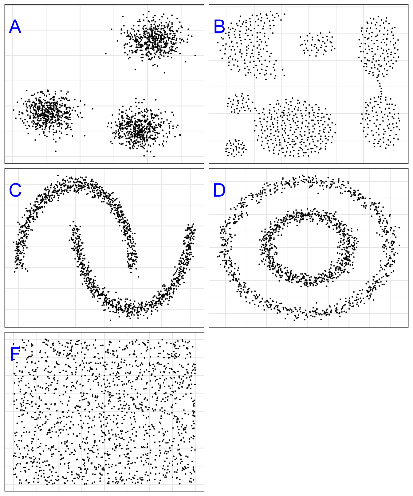

# Clustering

<!-- Matt -->

<!-- http://www.madgroup.path.cam.ac.uk/microarraysummary.shtml -->

## Introduction

## Types of cluster

(\#fig:clusterTypes)Example clusters

## Distance metrics

**Minkowski distance:**
\begin{equation}
  distance\left(x,y,p\right)=\left(\sum_{i=1}^{n} abs(x_i-y_i)^p\right)^{1/p}
  (\#eq:minkowski)
\end{equation}

## Clustering algorithms

### K-means

Pseudocode

### DBSCAN
Density-based spatial clustering of applications with noise

## Visualization
Dendrogram

Heatmap

## Examples

### Image segmentation

### Quality control

## Summary

### Applications

### Strengths

### Limitations

## Exercises

Exercise solutions: \@ref(solutions-clustering)

## Extended exercises

